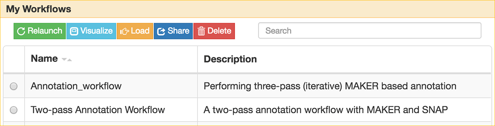
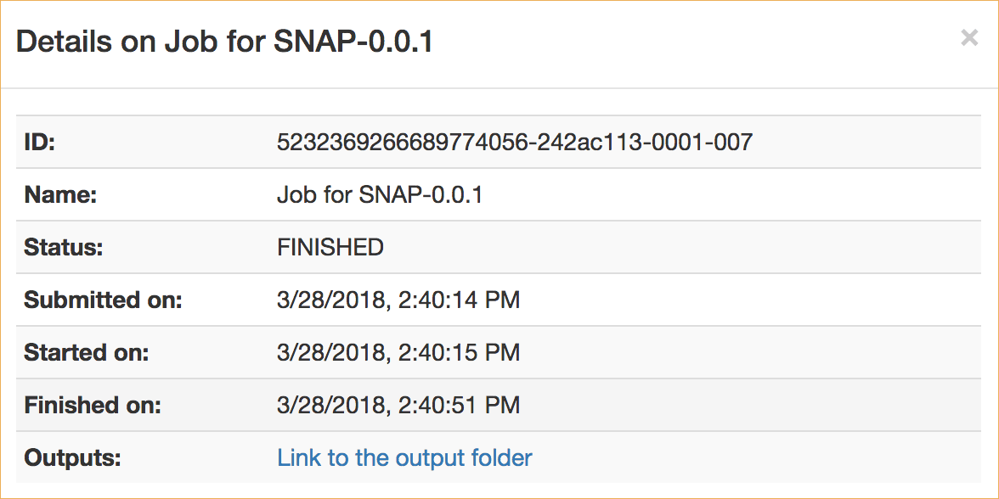
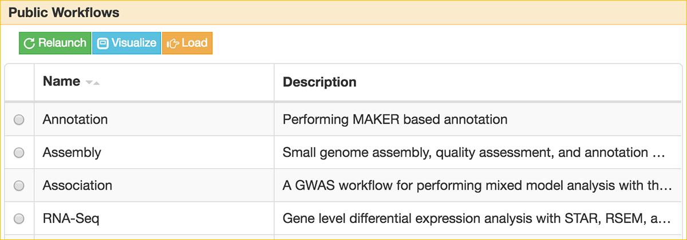

|CyVerse logo|_

|Home_Icon|_
`Learning Center Home <http://learning.cyverse.org/>`_


The Annotation Tutorial
---------------------------
This tutorial is a step-by-step guide for the Bioinformatics workshop of 2017 Plant Genome & Biotechnology meeting. It will cover the basic steps of using SciApps for performing annotation. Please refer to the above sections for more details.


----

**Example Data**

.. list-table::
    :header-rows: 1

    * - Input
      - Description
      - Example
    * - Assembled genome
      - A scaled-down genome that is comprised of the first 300kb of three chromosomes of rice
      - `test_genome.fasta <https://data.sciapps.org/example_data/maker/test_genome.fasta>`_
    * - Annotated gene models
      - MAKER output in GFF3 format (gzipped)
      - `my.all.gff.gz <https://data.sciapps.org/example_data/maker/my.all.gff.gz>`_

**Apps:**

.. list-table::
    :header-rows: 1

    * - App name
      - Version
      - Description
      - App link
      - Notes/other links
    * - MAKER
      - 0.0.1
      - A portable and easily configurable genome annotation pipeline
      - `SciApps App link <https://www.sciapps.org/app_id/MAKER-0.0.1>`_
      - `App documentation <http://www.yandell-lab.org/software/maker.html/>`_
    * - SNAP
      - 0.0.1
      - Semi-HMM-based Nucleic Acid Parser
      - `SciApps App link <https://www.sciapps.org/app_id/SNAP-0.0.1>`_
      - `App documentation <http://korflab.ucdavis.edu/software.html>`_

*Step 1: Requiring access to SciApps*
~~~~~~~~~~~~~~~~~~~~~~~~~~~~~~~~~~~~
This is one-time operation. Please login to `SciApps <https://www.SciApps.org/>`_ directly if you have completed this step once.

  1. Log into CyVerse User portal at https://user.cyverse.org.

  2. By default, you will be under the 'Services' page, click on 'AVAILABLE', then 'REQUEST ACCESS' to SciApps.

     |cyverse_user|

  3. Click on 'MY SERVICES', then click on 'LAUNCH' for Discovery Environment.

  4. Once in Discovery Environment, click to open the 'Data' window. You should see the **sci_data** folder under your root folder:/iplant/home/YOUR_USER_NAME.

     |de_data|

----

*Step 2: Uploading data for SciApps*
~~~~~~~~~~~~~~~~~~~~~~~~~~~~~~~~~~~~
This step will demo how to upload data to the sci_data folder for accessing from SciApps.

   1. Click **sci_data** folder to open it.

   2. Click 'Upload', then 'Import from URL' to import this URL: https://data.sciapps.org/example_data/maker/my.all.gff.gz

      |url_window|

      .. Note::
        This may take a few minutes. You can check the status by clicking the 'Bell' on the top corner of DE. Once importing completed, 'Refresh' the window to see the file. This is a GFF3 formatted file from MAKER.
  
   3. Alternatively, download the file and upload it using 'Simple Upload from Desktop'.


*Step 3: HMM parameters estimation with SNAP*
~~~~~~~~~~~~~~~~~~~~~~~~~~~~~~~~~~~~~~~~~~~~~~~~~

  1. Login to SciApps at https://www.SciApps.org.

  2. Click **Prediciton** category (left panel) or search for **SNAP**, then click **SNAP** to load **SNAP-0.0.1**.

  3. Under “GFF file” click **or Browse DataStore**, then navigate the CyVerse **sci_data** folder; select **my.all.gff.gz** and click 'Select and Close'.

     |data_window2|

     .. Tip::
       'Refresh' the window if you can not see the file under 'sci_data'. 

  4. Leave other parameters as default, and click **Submit Job**. You will be asked to confirm; click "Submit". You will be prompted to check the job status in the right panel.
       
     .. Tip::
       If you choose 'Yes' for Email Notification, an email will be sent once your analysis is completed.

*Step 4: Running MAKER with SNAP output*
~~~~~~~~~~~~~~~~~~~~~~~~~~~~~~~~~~~~~~~~~~~~~~~~
This step will show you how to use SNAP output with MAKER to do a second around annotation.

  1. Click **Annotation** category (left panel) or search for **MAKER**, then click **MAKER** to load **MAKER-0.0.1**.

     |build_workflow2|

  2. Under “Genome sequence file” click **or Browse DataStore**, then navigate the exampleData (*example_data > maker*); select **test_genome.fasta** and click 'Select and Close'.

  3. Click **SNAP-0.0.1** in the History panel to expand its outputs, then
     drag and drop **my.all.hmm** into the **SNAP HMM file** field.

  4. Under “Maker annotations” click **or Browse DataStore**, then navigate the exampleData (*example_data > maker*); select **my.all.gff.gz** and click 'Select and Close'.

  5. Leave others as defaults, then click the "Submit Job" button.

  6. Once COMPLETED, click **MAKER-0.0.1** in the History panel to expand its outputs, then click **maker_output.jbrowse** to visualize annotation results.

*Step 5: Creating a Workflow*
~~~~~~~~~~~~~~~~~~~~~~~~~~~~~~~~
This step will show you how to build a two-step workflow with previously completed MAKER and SNAP jobs.

  1. Check the checkboxes for step 1 (SNAP), and step 2 (MAKER) in the History panel, then click the ‘build a workflow’ link to load the Workflow building page.

     |build_workflow3|
    
     .. Tip::
        History panel Checkboxes and the workflow building page are interactive. Use the 'Select All' or 'Reset' button to simplify the selection process.

  2. Modify **Workflow Name** and **Workflow Description**, then click the ‘Build Workflow’ button to visualize the workflow.

     |annotation_workflow2|

     .. Note::
       The connection between **SNAP-0.0.1** and **MAKER-0.0.1**  (via **my.all.hmm**) is recorded through **dragging and dropping**.

  3. On the 'Workflow Diagram', you can save the workflow. Your saved workflows will appear in 'My Workflows' (under the 'Workflow' menu from top navigation panel).

     .. Tip::
       You can download the workflow from 'My workflows' as a JSON file, which can be passed to others for **sharing** the entire analysis.

----

*Step 6: Running a Workflow*
~~~~~~~~~~~~~~~~~~~~~~~~~~~~~~~~~~~~~~~
This step will show you how to run a workflow you created or someone shared with you.

  1. Navigate to ‘Workflow’, then ‘My workflows’, to load the workflow you created and saved (in **Step 2**).

     |myworkflows_window|

  2. Alternatively, you can load the workflow by navigating to 'Workflow', 'Load a workflow', then paste this URL: https://data.sciapps.org/misc/my_workflow.json or load a workflow JSON file from your PC.

     |load_workflow|
 
     .. Tip::
       Before loading a workflow, you can refresh the browser window to clear the History panel.

  3. Scroll down the main panel, then click **Submit Workflow**. You will be asked to confirm and prompted to check the job status in the right panel. Then a live workflow diagram will be displayed with real-time analysis status updates.

*Step 7: Using Annotation with GWAS*
~~~~~~~~~~~~~~~~~~~~~~~~~~~~~~~~~~~~~~~~
This step shows how we can use Gramene annotation data to examine GWAS outputs on SciApps. 

  1. Click 'Workflow' (from the top navigation bar), then 'Public workflows' to load the public workflow page in the main panel.

     |public_workflows|

  2. Check the 'Association' workflow, then click "Load". The App forms are loaded in the main panel, and analysis histories are loaded in the right panel.

     |association_workflow|

     .. Note::
       To view the workflow diagram, scroll down to the bottom of the main panel and click the 'Show Diagram' button.
 
   4. Once the workflow is loaded, click **EMMAX-0.0.2** in the History panel to expand its outputs.
    
   5. Click **manhattan.plot** from the list of outputs, you will be directed to the Manhattan plot of the results. Click on the Manhattan plot to check nearby annotated genes around the clicked position.

      |manhattan_plot|

      .. Note::
        The example here is using Sorghum chromosome 9 only. For your own data, use the options on the left side to check a specific chromosome or all chromosomes of your specific genome.

----

*Step 8: Using Apollo for Community Annotation*
~~~~~~~~~~~~~~~~~~~~~~~~~~~~~~~~~~~~~~~~~~~~~~~~
In reality, annotated genes from MAKER will be further filtered or even manually annotated before being released (for example, by Gramene/Plant Ensembl). For manual annotation of the MAKER results with Apollo, we set up a demo at http://data.maizecode.org/apollo. You can login with username: demo@demo.com, and password: demo.

*Summary*
~~~~~~~~~

This tutorial covers how to use SciApps for your annotaition work - from accessing data in CyVerse Data Store to launching jobs, building workflows, running workflows, visualizing results, importing workflows, and using annotation to interpret GWAS results.


More help and additional information
`````````````````````````````````````

..
    Short description and links to any reading materials

Search for an answer:
    `CyVerse Learning Center <http://learning.cyverse.org>`_ or
    `CyVerse Wiki <https://wiki.cyverse.org>`_

Post your question to the user forum:
    `Ask CyVerse <http://ask.iplantcollaborative.org/questions>`_

----

**Fix or improve this documentation:**

- On Github: `Repo link <https://github.com/CyVerse-learning-materials/SciApps_guide/blob/master/annotation.rst>`_
- Send feedback: `Tutorials@CyVerse.org <Tutorials@CyVerse.org>`_

----

  |Home_Icon|_
  `Learning Center Home <http://learning.cyverse.org/>`_

.. |CyVerse logo| image:: ./img/cyverse_rgb.png
    :width: 500
    :height: 100
.. _CyVerse logo: http://learning.cyverse.org/
.. |Home_Icon| image:: ./img/homeicon.png
    :width: 25
    :height: 25
.. _Home_Icon: http://learning.cyverse.org/

.. |load_workflow| image:: ./img/sci_apps/load_workflow.gif
    :width: 600
    :height: 135
.. |run_workflow| image:: ./img/sci_apps/run_workflow.gif
    :width: 660
    :height: 318
.. |running_workflow| image:: ./img/sci_apps/running_workflow.gif
    :width: 660
    :height: 299
.. |workflow_results| image:: ./img/sci_apps/workflow_results.gif
    :width: 660
    :height: 319
.. |manhattan_plot| image:: ./img/sci_apps/manhattan_plot.gif
    :width: 660
    :height: 355
.. |de_data| image:: ./img/sci_apps/de_data.gif
    :width: 660
    :height: 370


.. |status| image:: ./img/sci_apps/status.gif
    :width: 250
    :height: 60


.. |build_workflow2| image:: ./img/sci_apps/build_workflow2.gif
    :width: 660
    :height: 246
.. |build_workflow3| image:: ./img/sci_apps/build_workflow3.gif
    :width: 660
    :height: 294
.. |annotation_workflow2| image:: ./img/sci_apps/annotation_workflow2.gif
    :width: 660
    :height: 320


.. |association_workflow| image:: ./img/sci_apps/association_workflow0.gif
    :width: 660
    :height: 458
