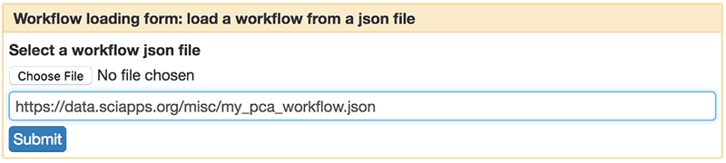
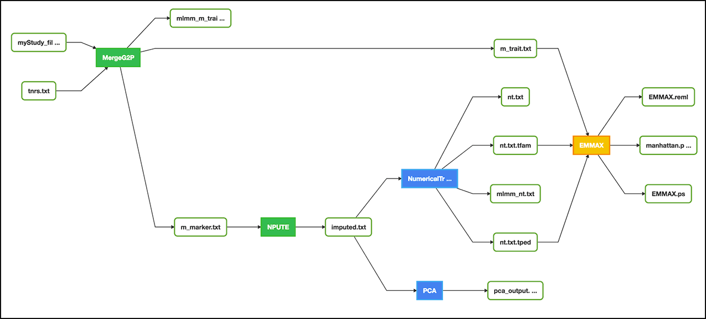
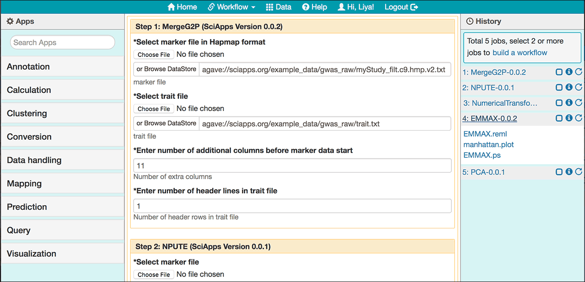

|CyVerse logo|_

|Home_Icon|_
`Learning Center Home <http://learning.cyverse.org/>`_


The Annotation Tutorial
---------------------------
This tutorial is a step-by-step guide for using SciApps to perform MAKER based annotation.


----

**Example Data**

.. list-table::
    :header-rows: 1

    * - Input
      - Description
      - Example
    * - Assembled genome
      - A scaled-down genome that is comprised of the first 300kb of three chromosomes of rice
      - `test_genome.fasta.gz <http://datacommons.cyverse.org/browse/iplant/home/sciapps/example/maker/test_genome.fasta.gz>`_
    * - Annotated gene models
      - MAKER output in GFF3 format
      - `maker_out.gff.gz <http://datacommons.cyverse.org/browse/iplant/home/sciapps/example/maker/my.all.gff.gz>`_

**Apps:**

.. list-table::
    :header-rows: 1

    * - App name
      - Version
      - Description
      - App link
      - Notes/other links
    * - MAKER
      - 2.32
      - A portable and easily configurable genome annotation pipeline
      - `MAKER-2.32 <https://www.sciapps.org/app_id/MAKER-2.32>`_
      - `MAKER documentation <http://www.yandell-lab.org/software/maker.html/>`_
    * - SNAP
      - 0.0.1
      - Semi-HMM-based Nucleic Acid Parser
      - `SNAP-0.0.1 <https://www.sciapps.org/app_id/SNAP-0.0.1>`_
      - `SNAP documentation <http://korflab.ucdavis.edu/software.html>`_

*Step 1: Requiring access to SciApps*
~~~~~~~~~~~~~~~~~~~~~~~~~~~~~~~~~~~~~~
This is one-time operation. Please login to `SciApps <https://www.SciApps.org/>`_ directly if you have completed this step before.

  1. Log into CyVerse User portal at https://user.cyverse.org.

  2. By default, you will be under the 'Services' page, click on 'AVAILABLE', then 'REQUEST ACCESS' to SciApps.

     |cyverse_user|

  3. Click on 'MY SERVICES', then click on 'LAUNCH' for Discovery Environment.

  4. Once in Discovery Environment, click to open the 'Data' window. You should see the **sci_data** folder under your root folder:/iplant/home/YOUR_USER_NAME.

     |de_data|

----

*Step 2: Uploading data for SciApps*
~~~~~~~~~~~~~~~~~~~~~~~~~~~~~~~~~~~~
This step will demo how to upload data to the sci_data folder for accessing from SciApps.

   1. Click **sci_data** folder to open it.

   2. Click 'Upload', then 'Import from URL' to import this URL: https://data.sciapps.org/example_data/maker/my.all.gff.gz

      |url_window|

      .. Note::
        This may take a few minutes. You can check the status by clicking the 'Bell' on the top right corner of DE. Once importing completed, 'Refresh' the window to see the file. This is a GFF3 formatted file from MAKER.
  
   3. Alternatively, use `Cyberduck <https://pods.iplantcollaborative.org/wiki/display/DS/Using+Cyberduck+for+Uploading+and+Downloading+to+the+Data+Store>`_ or `iCommands <https://pods.iplantcollaborative.org/wiki/display/DS/Using+iCommands>`_ for bulk data transfer to the sci_data folder.


*Step 3: HMM parameters estimation with SNAP*
~~~~~~~~~~~~~~~~~~~~~~~~~~~~~~~~~~~~~~~~~~~~~~~~~

  1. Login to SciApps at https://www.SciApps.org.

  2. Click **Prediciton** category (left panel) or search for **SNAP**, then click **SNAP** to load **SNAP-0.0.1**.

  3. Under “GFF file”, click **Browse DataStore**, then navigate to the **maker** folder (example > maker); select **maker_out.gff.gz** and click 'Select and Close'.

     |data_window2|

     .. Tip::
       Click 'Refresh' if you can not see any newly uploaded files. 

  4. Leave other parameters as default, and click **Submit Job**. You will be asked to confirm; click "Submit". You will be prompted to check the job status in the right panel.
       

*Step 4: Running MAKER with SNAP output*
~~~~~~~~~~~~~~~~~~~~~~~~~~~~~~~~~~~~~~~~~~~~~~~~
This step will demo how to use SNAP output with MAKER to do a second around annotation.

  1. Click **Annotation** category (left panel) or search for **MAKER**, then click to load **MAKER-2.32**.

  2. Under “Genome sequence file” click **Browse DataStore**, then navigate to the **maker** folder  (example > maker); select **test_genome.fasta.gz** and click 'Select and Close'.

  3. Click **SNAP-0.0.1** in the History panel to expand its outputs, then
     drag and drop **snap_out.hmm** into the **SNAP HMM file** field.

     |build_workflow2|

  4. Under “Maker annotations” click **Browse DataStore**, then navigate to the **maker** folder  (example > maker); select **maker_out.gff.gz** and click 'Select and Close'.

  5. Leave others as defaults, then click the "Submit Job" button.

  6. Once COMPLETED, click the **Visualization** icon for **MAKER-2.32** in the History panel to bring up its outputs. Select **jbrowse_out.view.tgz** from the list of outputs, then click **Visualize**, you will be directed to a genome browser to visualize your annotation results.

     |jbrowse_out|

*Step 5: Creating a Workflow*
~~~~~~~~~~~~~~~~~~~~~~~~~~~~~~~~
This step will demo how to build a two-step workflow with previously completed MAKER and SNAP jobs.

  1. Check the checkboxes for step 1 (SNAP), and step 2 (MAKER) in the History panel, then click the ‘build a workflow’ link to load the Workflow building page.

     |build_workflow3|
    
     .. Tip::
        History panel Checkboxes and the workflow building page are interactive. Use the 'Select All' or 'Reset' button to simplify the selection process.

  2. Modify **Workflow Name** and **Workflow Description**, then click the ‘Build Workflow’ button to visualize the workflow.

     |annotation_workflow2|

     .. Note::
       The connection between **SNAP-0.0.1** and **MAKER-2.32**  (via **my.all.hmm**) is recorded through **dragging and dropping**, which feeds the output of **SNAP** as an input for **MAKER**.

  3. On the 'Workflow Diagram', you can save the workflow. Your saved workflows will appear in 'My workflows' (under the 'Workflow' menu from top navigation panel).

     .. Note::
       You can select the workfrom from 'My workflows' and click **share** to get a direct link, which can be passed to others for **sharing** the entire analysis.
       |workflow_URL|

----

*Step 6: Running a Workflow*
~~~~~~~~~~~~~~~~~~~~~~~~~~~~~~~~~~~~~~~
This step will demo how to run a workflow you created or someone shared with you.

  1. Navigate to ‘Workflow’, then ‘My workflows’, to load the workflow you created and saved (in **Step 2**).

     |myworkflows_window|

     .. Note::
       Alternatively, you can load the app forms and job histories directly if you have the direct link for a workflow.

  2. Scroll down the main panel, then click **Submit Workflow**. You will be asked to confirm and prompted to check the job status in the right panel. Then a live workflow diagram will be displayed with real-time analysis status updates.

----

*Step 7: Using Apollo for Community Annotation*
~~~~~~~~~~~~~~~~~~~~~~~~~~~~~~~~~~~~~~~~~~~~~~~~
In reality, annotated genes from MAKER will be further filtered or even manually annotated before being released (for example, by Gramene/Plant Ensembl). For manual annotation of the MAKER results with Apollo, we set up a demo at http://data.maizecode.org/apollo. You can login with username: demo@demo.com, and password: demo.

*Summary*
~~~~~~~~~

This tutorial covers how to use SciApps for your annotaition work, including accessing data in CyVerse Data Store, launching jobs, building workflows, running workflows, visualizing results, and importing workflows to re-run.


More help and additional information
`````````````````````````````````````

..
    Short description and links to any reading materials

Search for an answer:
    `CyVerse Learning Center <http://learning.cyverse.org>`_ or
    `CyVerse Wiki <https://wiki.cyverse.org>`_

Post your question to the user forum:
    `Ask CyVerse <http://ask.iplantcollaborative.org/questions>`_

----

**More resources:**

- `GMOD MAKER tutorial <http://gmod.org/wiki/MAKER_Tutorial>`_
- `MAKER 2.31.9 with CCTOOLS Jetstream Tutorial <https://pods.iplantcollaborative.org/wiki/display/TUT/MAKER+2.31.9+with+CCTOOLS+Jetstream+Tutorial>`_
- `Bioinformatics workshop of 2017 Plant Genome & Biotechnology meeting <https://wiki.cyverse.org/wiki/display/Events/2017+11+29+Half-day+workshop+on+bioinformatics+tools+for+Plant+Genomics>`_

----

**Fix or improve this documentation:**

- On Github: `Repo link <https://github.com/CyVerse-learning-materials/SciApps_guide/blob/master/annotation.rst>`_
- Send feedback: `Tutorials@CyVerse.org <Tutorials@CyVerse.org>`_

----

  |Home_Icon|_
  `Learning Center Home <http://learning.cyverse.org/>`_

.. |CyVerse logo| image:: ./img/cyverse_rgb.png
    :width: 500
    :height: 100
.. _CyVerse logo: http://learning.cyverse.org/
.. |Home_Icon| image:: ./img/homeicon.png
    :width: 25
    :height: 25
.. _Home_Icon: http://learning.cyverse.org/
.. |my_workflow| image:: ./img/sci_apps/my_workflow.gif
    :width: 660
    :height: 168

.. |run_workflow| image:: ./img/sci_apps/run_workflow.gif
    :width: 660
    :height: 318


.. |manhattan_plot| image:: ./img/sci_apps/manhattan_plot.gif
    :width: 660
    :height: 355

.. |url_window| image:: ./img/sci_apps/url_window.gif
    :width: 660
    :height: 356
.. |data_window2| image:: ./img/sci_apps/data_window2.gif
    :width: 660
    :height: 329
.. |status| image:: ./img/sci_apps/status.gif
    :width: 250
    :height: 60
.. |agave_status| image:: ./img/sci_apps/agave_status.gif
    :width: 550
    :height: 322
.. |cyverse_user| image:: ./img/sci_apps/cyverse_user.gif
    :width: 660
    :height: 327


.. |myworkflows_window| image:: ./img/sci_apps/my_workflow.gif
    :width: 656
    :height: 170
.. |public_workflows| image:: ./img/sci_apps/public_workflows.gif
    :width: 660
    :height: 223
.. |association_workflow| image:: ./img/sci_apps/association_workflow0.gif
    :width: 651
    :height: 533
.. |jbrowse_out| image:: ./img/sci_apps/jbrowse_out.gif
    :width: 660
    :height: 325
.. |workflow_URL| image:: ./img/sci_apps/workflow_URL.gif
    :width: 582
    :height: 182
