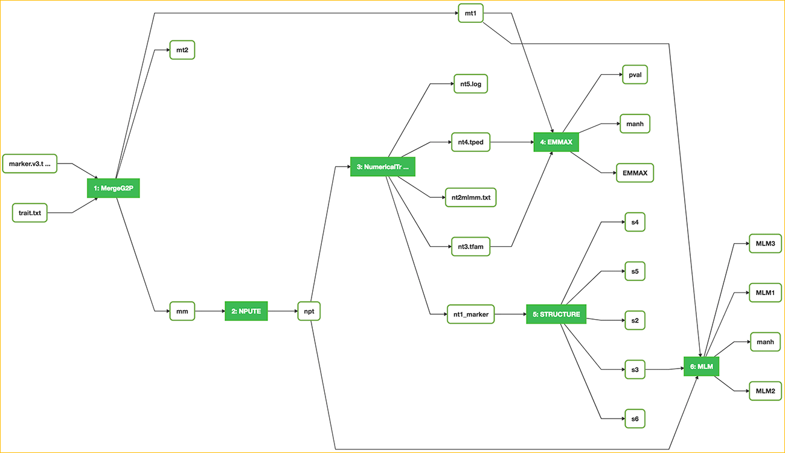
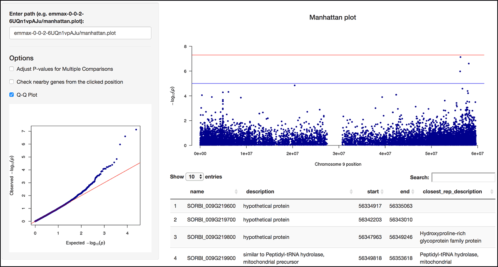

|CyVerse logo|_

|Home_Icon|_
`Learning Center Home <http://learning.cyverse.org/>`_


The Association Workflow
---------------------------------
A genome-wide association study (or GWAS) is an examination of a genome-wide set of genetic variants in a population of individuals aimed at determining whether any variant is associated with a trait. In this section, we will walk through the Association workflow available on the 'Public workflows' page. The workflow contains following operations in order: intersecting marker data with trait data, imputing missing markers, estimating population structure with PCA, and performing mixed-model based analyses with three different tools (EMMAX, TASSEL, and MLMM). 

We will start by loading the workflow, visualizing results, creating a new workflow with EMMAX method only, and then add additional analyses to estimate population structure and perform mixed model analysis.  

----


**Example Data**

.. list-table::
    :header-rows: 1

    * - Input
      - Description
      - Example
    * - Marker file (Sorghum bicolor assembly v2 chromosome 9 only)
      - Marker data in TASSEL Hapmap format
      - `myStudy_filt.c9.hmp.v2.txt <https://data.sciapps.org/example_data/gwas_raw/myStudy_filt.c9.hmp.v2.txt>`_
    * - Trait file
      - Trait data in TASSEL trait format
      - `trait.txt <https://data.sciapps.org/example_data/gwas_raw/trait.txt>`_

**SciApps App(s):**

.. list-table::
    :header-rows: 1

    * - App name
      - Version
      - Description
      - App link
      - Notes/other links
    * - MergeG2P
      - 0.0.2
      - Intersect marker data with trait data
      - `App link <https://www.sciapps.org/app_id/MergeG2P-0.0.2>`_
      -
    * - NPUTE
      - 0.0.1
      - Imputes missing markers via voting from K-nearest-neighbors (KNN)
      - `App link <https://www.sciapps.org/app_id/NPUTE-0.0.1>`_
      - `App documentation <http://compgen.unc.edu/NPUTE_README.html>`_
    * - NumericalTransform-TASSEL
      - 4.3.15
      - Numerical Transform of marker data using TASSEL and PLINK
      - `App link <https://www.sciapps.org/app_id/NumericalTransform-TASSEL-4.3.15>`_
      -
    * - MLM-TASSEL
      - 5.1.23
      - Mixed Linear Model analysis using TASSEL
      - `App link <https://www.sciapps.org/app_id/MLM-TASSEL-5.1.23>`_
      - `App documentation <http://www.maizegenetics.net/>`_
    * - EMMAX
      - 0.0.2
      - Association mapping with consideration of sample structure
      - `App link <https://www.sciapps.org/app_id/EMMAX-0.0.2>`_
      - `App documentation <http://genetics.cs.ucla.edu/emmax/>`_
    * - MLMM
      - 0.0.2
      - An efficient multi-locus mixed-model approach for GWAS
      - `App link <https://www.sciapps.org/app_id/MLMM-0.0.2>`_
      - `App documentation <https://cynin.gmi.oeaw.ac.at/home/resources/mlmm>`_
    * - PCA
      - 0.0.1
      - Principal Component Analysis
      - `App link <https://www.sciapps.org/app_id/PCA-0.0.1>`_
      - `App documentation <https://stat.ethz.ch/R-manual/R-patched/library/stats/html/prcomp.html>`_
    * - CloudSTRUCTURE
      - 2.3.4
      - Parallelized STRUCTURE software for estimating population structures
      - `App link <https://www.sciapps.org/app_id/CloudSTRUCTURE-2.3.4>`_
      - `App documentation <http://pritch.bsd.uchicago.edu/structure.html>`_

*Step 1: Importing the Association Workflow*
~~~~~~~~~~~~~~~~~~~~~~~~~~~~~~~~~~~~~~~~~~~~~~
This step will show you how to import the Association workflow into your own workspace.

  1. Log into `SciApps <https://www.SciApps.org/>`_

  2. Click 'Workflow' (from the top navigation bar), then 'Public workflows' to load the public workflow page in the main panel

     |public_workflows|

  3. Check the 'Association' workflow, then click "Load". The App forms are loaded in the main panel, and analysis histories are loaded in the right panel

     |association_workflow|

     .. Note::
       To view the workflow diagram, scroll down to the bottom of the main panel and click the 'Show Diagram' button
 
----

*Step 2: Visualizing the Association Workflow Results*
~~~~~~~~~~~~~~~~~~~~~~~~~~~~~~~~~~~~~~~~~~~~~~~~~~
This step will show you how to visualize association results for EMMAX and PCA. You can check other results with the similar operations.

   1. Once the workflow is loaded, click **EMMAX-0.0.2** in the History panel to expand its outputs.
    
   2. Click **manhattan.plot** from the list of outputs, you will be directed to the Manhattan plot of the results. You can also check Q-Q plot and/or click the Manhattan plot to check nearby genes around the clicked position.

      |manhattan_plot|

      .. Note::
        The example here is using chromosome 9 only. And the Manhattan plot is pre-configured to display the chromosome 9 of sorghum (BTx623). For your own data, use the options on the left side to select a specific chromosome, or all chromosomes of your genome.

   3. Use the options on the left side for P-values adjustments, specifying species, chromosome, neighboring window size, and display Q-Q plot.

      .. Tip::
        Both Manhattan plot and Q-Q plot are interactive with all of the options.

   4. For visualizing **PCA** outputs, click **PCA-0.0.1** in the History panel to expand its outputs. There are two image outputs:  `pcplot <https://cran.r-project.org/web/packages/ggfortify/vignettes/plot_pca.html>`_
      and `scree plot <http://support.minitab.com/en-us/minitab/17/topic-library/modeling-statistics/multivariate/principal-components-and-factor-analysis/what-is-a-scree-plot/>`_

      |pca_output1| |pca_output2|
      
*Step 3: Creating a New Association Workflow*
~~~~~~~~~~~~~~~~~~~~~~~~~~~~~~~~~~~~~~~~~~~~~~
This step will demo how to build a workflow from the loaded history. Assume we just want to use EMMAX for association analysis.

   1. Check the checkboxes for step 1 (MergeG2P), 2 (NPUTE), 3 (NumericalTransform-TASSEL), and 5 (EMMAX) in the History panel, then click the 'build a workflow' link to load the Workflow building page.

      |build_workflow|

      .. Tip::
        History panel checkboxes and the workflow building page are interactive. Use the 'Select All' or 'Reset' button to simplify the selection step

   2. Modify **Workflow Name** and **Workflow Description**, then click the 'Build Workflow' button to visualize the workflow

      .. Tip::
        All nodes of the diagram are interactive. Mouse over for hints for full name, documentation, etc.
        |emmax_workflow|

   3. On the 'Workflow Diagram', you can save the workflow. Your saved workflows will appear in 'My Workflows' (under the 'Workflow' menu from top navigation panel)

      .. Tip::
        From 'My workflow', You can load the new workflow to run or download the workflow as a JSON file, which can be passed to others for **sharing** the entire analysis.


----

*Step 4: Adding New Analyses to the Association Workflow*
~~~~~~~~~~~~~~~~~~~~~~~~~~~~~~~~~~~~~~~~~~~~~~~~~~~~~~~~~~
This step will show you how to add new analysis to the workflow built above. We will use CloudStructure instead of PCA to estimated population structure, then pass the estimation to MLM-TASSEL for performing association analysis.

  1. Click **Clustering** category (left panel) or search for **structure**, then click **CloudSTRUCUTRE** to load **CloudSTRUCTURE-2.3.4**

  2. Click **NumericalTransform-TASSEL-4.3.15** in the History panel to expand its outputs, then drag and drop **nt.txt** into the **Select marker file** field

  3. Enter **12559** for 'number of loci' and **310** for 'number of individuals, leave others as defaults, then click the "Submit Job" button. Once completed, click to expand its outputs. 
      
     .. Note::
       These numbers are in the `nt.txt.log <https://data.sciapps.org/results/job-5681552548147892711-242ac113-0001-007-job-for-numericaltransform-tassel-4-3-15/nt.txt.log>`_ file from the **NumericalTransform-TASSEL-4.3.15** job   

  4. Click **Mapping** category, then **MLM-TASSEL** to load **MLM-TASSEL-5.1.23**. Drag and drop **m_trait.txt** (MergeG2P-0.0.2) to **Input Trait Data**, **imputed.txt** (NPUTE-0.0.1) to **Input Marker Data**, and **s3_f** (CloudSTRUCTURE-2.3.4) to **Input Structure Data**

     |association_workflow2|

  5. Leave others as defaults, then click the "Submit Job" button. Once completed, check all jobs to build and save a new workflow. The workflow can be re-run or shared as described before.

     |association_workflow3|

  6. As in **Step 2**, you can visualize the **Manhattan plot** of MLM-TASSEL outputs and compare it with the EMMAX output or MLM-TASSEL output when PCA is used.

----

*Summary*
~~~~~~~~~

As shown in this section, various customized Association workflows can be constructed on SciApps. The interactive Manhattan plot also provides an easy way to examine nearby gene annotations around a significant loci. 

More help and additional information
`````````````````````````````````````

..
    Short description and links to any reading materials

Search for an answer:
    `CyVerse Learning Center <http://learning.cyverse.org>`_ or
    `CyVerse Wiki <https://wiki.cyverse.org>`_

Post your question to the user forum:
    `Ask CyVerse <http://ask.iplantcollaborative.org/questions>`_

----

**Fix or improve this documentation:**

- On Github: `Repo link <https://github.com/CyVerse-learning-materials/SciApps_guide/blob/master/association.rst>`_
- Send feedback: `Tutorials@CyVerse.org <Tutorials@CyVerse.org>`_

----

  |Home_Icon|_
  `Learning Center Home <http://learning.cyverse.org/>`_

.. |CyVerse logo| image:: ./img/cyverse_rgb.png
    :width: 500
    :height: 100
.. _CyVerse logo: http://learning.cyverse.org/
.. |Home_Icon| image:: ./img/homeicon.png
    :width: 25
    :height: 25
.. _Home_Icon: http://learning.cyverse.org/
.. |public_workflows| image:: ./img/sci_apps/public_workflows.gif
    :width: 660
    :height: 223
.. |association_workflow| image:: ./img/sci_apps/association_workflow0.gif
    :width: 660
    :height: 458
.. |build_workflow| image:: ./img/sci_apps/build_workflow.gif
    :width: 660
    :height: 355
.. |emmax_workflow| image:: ./img/sci_apps/emmax_workflow.gif
    :width: 660
    :height: 329
.. |association_workflow2| image:: ./img/sci_apps/association_workflow2.gif
    :width: 660
    :height: 402


.. |pca_output1| image:: ./img/sci_apps/pca_output1.gif
    :width: 300
    :height: 297
.. |pca_output2| image:: ./img/sci_apps/pca_output2.gif
    :width: 300
    :height: 284
