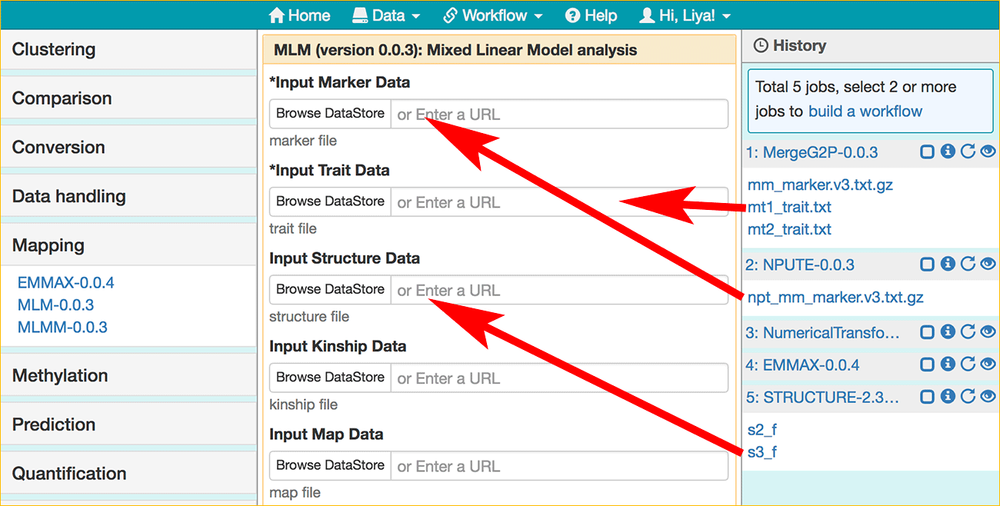

|CyVerse logo|_

|Home_Icon|_
`Learning Center Home <http://learning.cyverse.org/>`_


The Association Workflow
---------------------------------
A genome-wide association study (or GWAS) is an examination of a genome-wide set of genetic variants in a population of individuals aimed at determining whether any variant is associated with a trait. In this section, we will walk through the Association workflow available on the 'Public workflows' page. The workflow contains following operations in order: intersecting marker data with trait data, imputing missing markers, estimating population structure with PCA, and performing mixed-model based analyses with two different tools (EMMAX and TASSEL MLM). The example data used here are a subset of the published data (Morris, G., et al. `PNAS 110.2 (2013): 453-458 <http://www.pnas.org/content/110/2/453.long>`_).

We will start by loading the workflow, visualizing results, creating a new workflow with the EMMAX method, and then add additional analyses to estimate population structure and perform an association analysis.  

----


**Example Data**

.. list-table::
    :header-rows: 1

    * - Input
      - Description
      - Example
    * - Marker file (Sorghum bicolor v3 chromosome 9)
      - Marker data in TASSEL Hapmap format
      - `marker.v3.txt.gz <http://datacommons.cyverse.org/browse/iplant/home/sciapps/example/gwas/marker.v3.txt.gz>`_
    * - Trait file
      - Trait data in TASSEL trait format
      - `trait.txt <http://datacommons.cyverse.org/browse/iplant/home/sciapps/example/gwas/trait.txt>`_

**Apps:**

.. list-table::
    :header-rows: 1

    * - App name
      - Version
      - Description
      - App link
      - Notes/other links
    * - MergeG2P
      - 0.0.3
      - Intersect marker data with trait data
      - `MergeG2P-0.0.3 <https://www.sciapps.org/app_id/MergeG2P-0.0.3>`_
      -
    * - NPUTE
      - 0.0.3
      - Imputes missing markers via voting from K-nearest-neighbors (KNN)
      - `NPUTE-0.0.3 <https://www.sciapps.org/app_id/NPUTE-0.0.3>`_
      - `NPUTE documentation <http://compgen.unc.edu/NPUTE_README.html>`_
    * - NumericalTransform
      - 0.0.3
      - Numerical Transform of marker data using TASSEL and PLINK
      - `NumericalTransform-0.0.3 <https://www.sciapps.org/app_id/NumericalTransform-0.0.3>`_
      -
    * - MLM
      - 0.0.3
      - Mixed Linear Model analysis using TASSEL
      - `MLM-0.0.3 <https://www.sciapps.org/app_id/MLM-0.0.3>`_
      - `TASSEL documentation <http://www.maizegenetics.net/>`_
    * - EMMAX
      - 0.0.4
      - Association mapping with consideration of sample structure
      - `EMMAX-0.0.4 <https://www.sciapps.org/app_id/EMMAX-0.0.4>`_
      - `EMMAX documentation <http://genetics.cs.ucla.edu/emmax/>`_
    * - MLMM
      - 0.0.3
      - An efficient multi-locus mixed-model approach for GWAS
      - `MLMM-0.0.3 <https://www.sciapps.org/app_id/MLMM-0.0.3>`_
      - `MLMM documentation <https://cynin.gmi.oeaw.ac.at/home/resources/mlmm>`_
    * - PCA
      - 0.0.3
      - Principal Component Analysis
      - `PCA-0.0.3 <https://www.sciapps.org/app_id/PCA-0.0.3>`_
      - `PCA documentation <https://stat.ethz.ch/R-manual/R-patched/library/stats/html/prcomp.html>`_
    * - STRUCTURE
      - 2.3.4.1
      - Parallelized STRUCTURE software for estimating population structures
      - `STRUCTURE-2.3.4.1 <https://www.sciapps.org/app_id/STRUCTURE-2.3.4.1>`_
      - `STRUCTURE documentation <http://pritch.bsd.uchicago.edu/structure.html>`_

*Step 1: Importing the Workflow*
~~~~~~~~~~~~~~~~~~~~~~~~~~~~~~~~~~
This step will demonstrate how to import the Association workflow into your own workspace.

  1. Log into SciApps at https://www.SciApps.org.

  2. Click 'Workflow' (from the top navigation bar), then 'Public workflows' to load the public workflow page in the main panel.

     |public_workflows|

  3. Check the 'Association' workflow, then click "Load". The App forms are loaded in the main panel, and analysis histories are loaded in the right panel.

     |association_workflow|

     .. Note::
       Click the output node of the workflow diagram, you will be directed to the output folder. To check a specific output, click the output name from the History panel.
 
----

*Step 2: Visualizing the Results*
~~~~~~~~~~~~~~~~~~~~~~~~~~~~~~~~~~~~
This step will walk through how to visualize the results of EMMAX and PCA. You can check other results with the similar operations.

   1. Once the workflow is loaded, in the History panel, click the **Visualization** icon for **EMMAX-0.0.4** to bring up its outputs.
    
   2. Select **manhattan_plot.view.tgz** from the list of outputs, then click **Visualizae**, you will be directed to the `Manhattan plot <https://en.wikipedia.org/wiki/Manhattan_plot>`_ of the results. You can also check Q-Q plot and click the Manhattan plot to check nearby genes around the clicked position.

      |manhattan_plot|

      .. Warning::
        The manhattan plot will be displayed in a new window, so please check if pop-ups from SciApps are blocked by your web browser.

      .. Note::
        The example here is using chromosome 9 only. And the Manhattan plot is pre-configured to display the chromosome 9 of sorghum (BTx623). For your own data, use the options on the left side to select a specific chromosome or all chromosomes of your genome.

   3. Use the options on the left panel for P-values adjustments, specifying species, chromosome, neighbouring window size, and display Q-Q plot.

      .. Note::
        Both Manhattan plot and Q-Q plot are interactive with all of the options.

   4. Click on the most significant SNP to bring up the table of nearby genes. Then type **229800** in the search box (above the table) to locate a dwarf gene, dw1 (SORBI_009G229800).

      .. Tip::
        From the left panel, you can increase the 'window size' to list more nearby genes.

   5. For visualizing **PCA** outputs, click the **Visualization** icon for **PCA-0.0.3** to bring up its outputs. Select the image file from the list of outputs, then click **Visualizae** to open the image in a web browser. There are two image outputs:  `pcplot <https://cran.r-project.org/web/packages/ggfortify/vignettes/plot_pca.html>`_ and `scree plot <http://support.minitab.com/en-us/minitab/17/topic-library/modeling-statistics/multivariate/principal-components-and-factor-analysis/what-is-a-scree-plot/>`_.

      |pca_output1| |pca_output2|
      
*Step 3: Creating a New Workflow*
~~~~~~~~~~~~~~~~~~~~~~~~~~~~~~~~~~
This step will demo how to build a workflow from the loaded history. Assuming we just want to use EMMAX for association analysis, based on the workflow diagram above, we will also need MergeG2P, NPUTE, and NumericalTransform if given new marker data and/or new trait data.

   1. Check the checkboxes for step 1 (MergeG2P), 2 (NPUTE), 5 (NumericalTransform), and 6 (EMMAX) in the History panel, then click the 'build a workflow' link to load the Workflow building page.

      |build_workflow|

      .. Tip::
        History panel checkboxes and the workflow building page are interactive. Use the 'Select All' or 'Reset' button to simplify the selection step.

   2. Click the 'Build Workflow' button to visualize the workflow diagram.

      .. Tip::
        All nodes of the diagram are interactive. Mouse over for hints, full name, documentation, etc. Be sure to modify **Workflow Name** and **Workflow Description** while saving it in the next step.

        |emmax_workflow|

   3. On the 'Workflow Diagram', you can also save the workflow. Your saved workflows will appear in 'My Workflows' (under the 'Workflow' menu from top navigation panel).

      .. Tip::
        From 'My workflow', You can **load** the new workflow to run or **share** the workflow with a direct URL, which can be passed to others for **sharing** the entire analysis.


----

*Step 4: Adding New Analyses to the Workflow*
~~~~~~~~~~~~~~~~~~~~~~~~~~~~~~~~~~~~~~~~~~~~~~~
This step will show you how to add new analysis to the workflow built above. We will use **STRUCTURE** instead of **PCA** to estimate population structure, then pass the estimation to MLM for performing association analysis.

  1. Click **Clustering** category (left panel) or search for **structure**, then click **STRUCUTRE-2.3.4.1** to load **STRUCTURE-2.3.4.1**.

  2. Click **NumericalTransform-0.0.3** in the History panel to expand its outputs, then drag and drop **nt1_marker.txt.gz** into the **Select marker file** field.

     .. Warning::
       If the input field is not empty, be sure to clear it before dragging and dropping new input there.
 
  3. Enter **12063** for 'number of loci' and **310** for 'number of individuals, leave others as defaults, then click the "Submit Job" button. Once completed, click to expand its outputs. 
      
     .. Note::
       These numbers are in the `nt5.log <http://datacommons.cyverse.org/browse/iplant/home/lwang/sci_data/results/NumericalTransform-0.0.3_8f2cbb62-b136-4caf-89c6-3e33c079e682/nt5.log>`_ file from the **NumericalTransform-0.0.3** job.   

  4. Click **Mapping** category, then **MLM-0.0.3** to the App form. Drag and drop **mt1_trait.txt** (MergeG2P-0.0.3) to **Input Trait Data**, **npt_mm_marker.v3.txt.gz** (NPUTE-0.0.3) to **Input Marker Data**, and **s3_f** (STRUCTURE-2.3.4.1) to **Input Structure Data**.

     |association_workflow2|

  5. Leave others as defaults, then click the "Submit Job" button. Once completed, select all jobs to build a new workflow. The workflow can be re-run or shared as described before.

     |association_workflow3|

     .. Tip::
       As in **Step 2**, you can visualize the **Manhattan plot** of MLM outputs and compare it with that of EMMAX or MLM (when PCA is used for estimating population structure).

  6. Similarly, **MLMM-0.0.3** can be used for multi-locus mixed model testing with loading the **MLMM-0.0.3** app form, dragging and dropping **mt2_trait.txt** (MergeG2P-0.0.3) to **Input Trait Data**, and **nt2mlmm.txt.gz** (NumericalTransform-0.0.3) to **Input Marker Data**.

----

*Summary*
~~~~~~~~~

As shown in this section, various customized Association workflows can be constructed on SciApps. The interactive Manhattan plot also provides an easy way to examine nearby gene annotations around significant loci. 

More help and additional information
`````````````````````````````````````

..
    Short description and links to any reading materials

Search for an answer:
    `CyVerse Learning Center <http://learning.cyverse.org>`_ or
    `CyVerse Wiki <https://wiki.cyverse.org>`_

Post your question to the user forum:
    `Ask CyVerse <http://ask.iplantcollaborative.org/questions>`_

----

**Fix or improve this documentation:**

- On Github: `Repo link <https://github.com/CyVerse-learning-materials/SciApps_guide/blob/master/association.rst>`_
- Send feedback: `Tutorials@CyVerse.org <Tutorials@CyVerse.org>`_

----

  |Home_Icon|_
  `Learning Center Home <http://learning.cyverse.org/>`_

.. |CyVerse logo| image:: ./img/cyverse_rgb.png
    :width: 500
    :height: 100
.. _CyVerse logo: http://learning.cyverse.org/
.. |Home_Icon| image:: ./img/homeicon.png
    :width: 25
    :height: 25
.. _Home_Icon: http://learning.cyverse.org/
.. |public_workflows| image:: ./img/sci_apps/public_workflows.gif
    :width: 660
    :height: 223
.. |association_workflow| image:: ./img/sci_apps/association_workflow0.gif
    :width: 651
    :height: 463
.. |build_workflow| image:: ./img/sci_apps/build_workflow.gif
    :width: 651
    :height: 233
.. |emmax_workflow| image:: ./img/sci_apps/emmax_workflow.gif
    :width: 651
    :height: 292

.. |association_workflow3| image:: ./img/sci_apps/association_workflow3.gif
    :width: 651
    :height: 375
.. |manhattan_plot| image:: ./img/sci_apps/manhattan_plot.gif
    :width: 660
    :height: 355
.. |pca_output1| image:: ./img/sci_apps/pca_output1.gif
    :width: 300
    :height: 297
.. |pca_output2| image:: ./img/sci_apps/pca_output2.gif
    :width: 300
    :height: 284
