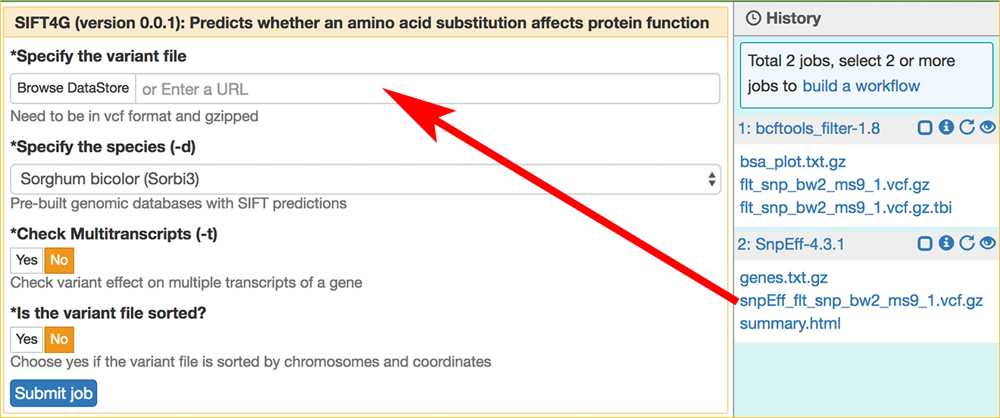
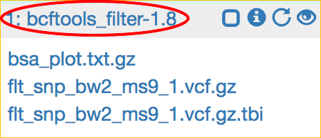
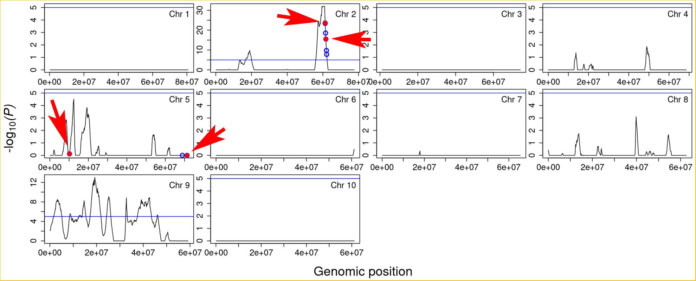

|CyVerse logo|_

|Home_Icon|_
`Learning Center Home <http://learning.cyverse.org/>`_


The Bulked Segregant Analysis Tutorial
---------------------------
This tutorial is a step-by-step guide for using SciApps to perform bulked segregant analysis. The example data used here is from studying the sorghum Ms9 gene, located in chromosome 2, which encodes a PHD-finger transcription factor critical for pollen development (`reference <https://dl.sciencesocieties.org/publications/tpg/articles/0/0/190020>`_). The ms9 mutant plants (Mu574, right in the image) are crossed by the WT BTx623 pollen (left) to generate the F1 seeds. The F1 plants produced F2 seeds through self-fertilization. Leaf tissues from 20 confirmed F2 mutants are pooled, quality-checked, and subjected to 150-bp paired-end sequencing on an Illumina X-10 instrument. 
 
    |sorghum_ms9|

To reduce the total computation time, we start the tutorial with variant filtering, skipping the alignment of raw reads with Bowtie2 and calling SNPs with bcftools. SNPs are filtered by the EMS mutation type (G to A or C to T), read depth, background, and minimum allele frequency. SnpEff is then used to annotate the filtered SNPs. Annotated SNPs are passed to SIFT4G for predicting amino acid substitution effects. Finally, results from all three steps are combined for visualization using the app, bsa_viewer. 

Ems_viewer provides an interactive visualization interface for confirming whether the candidate genes are true or false positives. Then, at the last, we use Ensembl Plants/Gramene to identify mutant lines that contained independent mutation alleles in the candidate gene for further verification.

----

**Example Data**

.. list-table::
    :header-rows: 1

    * - Input
      - Description
      - Example
      - Variants called with bcftools
      - `snp_bw2_ms9_1.vcf.gz <https://data.cyverse.org/dav-anon/iplant/home/lwang/sci_data/results/bcftools_call-1.8_8ac63e0f-53da-427d-b58f-a379f1b10443/snp_bw2_ms9_1.vcf.gz>`_

**Apps:**

.. list-table::
    :header-rows: 1

    * - App name
      - App link
      - Description
      - Notes/other links
    * - Bowtie2
      - `Bowtie2-2.3.2 <https://www.sciapps.org/app_id/Bowtie2-2.3.2>`_
      - Fast and sensitive read alignment
      - `Bowtie2 documentation <http://bowtie-bio.sourceforge.net/bowtie2/manual.shtml>`_
    * - bcftools_call
      - `bcftools_call-1.8 <https://www.sciapps.org/app_id/bcftools_call-1.8>`_
      - SNP/indel calling
      - `bcftools documentation <http://www.htslib.org/doc/bcftools-1.8.html>`_
    * - bcftools_filter
      - `bcftools_filter-1.8 <https://www.sciapps.org/app_id/bcftools_filter-1.8>`_
      - SNP/indel filtering
      - `bcftools documentation <http://www.htslib.org/doc/bcftools-1.8.html>`_
    * - SnpEff
      - `SnpEff-4.3.1 <https://www.sciapps.org/app_id/SnpEff-4.3.1>`_
      - Annotating variants
      - `SnpEff documentation <http://snpeff.sourceforge.net/SnpEff.html>`_
    * - SIFT4G
      - `SIFT4G-0.0.1 <https://www.sciapps.org/app_id/SIFT4G-0.0.1>`_
      - A faster version of SIFT that predicts whether an amino acid substitution affects protein function
      - `SIFT4G documentation <https://sift.bii.a-star.edu.sg/sift4g/>`_
    * - bsa_viewer
      - `bsa_viewer-0.0.1 <https://www.sciapps.org/app_id/bsa_viewer-0.0.1>`_
      - Interactive visualization of variants and segregation
      - `Shiny documentation <https://shiny.rstudio.com/>`_

*Step 1: Requiring access to SciApps*
~~~~~~~~~~~~~~~~~~~~~~~~~~~~~~~~~~~~~~
This is one-time operation. Please login to `SciApps <https://www.SciApps.org/>`_ directly if you have completed this step before.

  1. Log into CyVerse User portal at https://user.cyverse.org.

  2. By default, you will be under the 'Services' page, click on 'AVAILABLE', then 'REQUEST ACCESS' to SciApps.

     |cyverse_user|

  3. Click on 'MY SERVICES', then click on 'LAUNCH' for Discovery Environment.

  4. Once in Discovery Environment, click to open the 'Data' window. You should see the **sci_data** folder under your root folder:/iplant/home/YOUR_USER_NAME/sci_data.

     |de_data|

----

*Step 2: Uploading data for SciApps*
~~~~~~~~~~~~~~~~~~~~~~~~~~~~~~~~~~~~
This step will demo how to upload data (using CyVerse Discovery Environment) to the sci_data folder for accessing from SciApps.

   1. Click **sci_data** folder to open it.

   2. Click 'Upload', then 'Import from URL' to import this URL: https://data.cyverse.org/dav-anon/iplant/home/lwang/sci_data/results/bcftools_call-1.8_8ac63e0f-53da-427d-b58f-a379f1b10443/snp_bw2_ms9_1.vcf.gz

      |url_window|

      .. Note::
        Alternatively, you can click the above URL to download the file to your computer, then use 'Simple Upload from Desktop' to upload the file.

      .. Note::
        This may take a few minutes. You can check the status by clicking the 'Bell' on the top right corner of DE. Once importing completed, 'Refresh' the window to see the file. This is a variant file in gzipped VCF format from aligning the raw reads to Sorghum v3 assembly with Bowtie2 and calling variants with bcftools.
        
      .. Warning::
         If you are using the Chrome web browser and have grammarly turned on, the 'Import from URL' button will not be activated after pasting the URL. You can turn off grammarly for the page and reload the import form or switch to a different web browser.
  
   3. Alternatively, use `Cyberduck <https://pods.iplantcollaborative.org/wiki/display/DS/Using+Cyberduck+for+Uploading+and+Downloading+to+the+Data+Store>`_ or `iCommands <https://pods.iplantcollaborative.org/wiki/display/DS/Using+iCommands>`_ for bulk data transfer to the sci_data folder.


*Step 3: Variant filtering with bcftools_filter*
~~~~~~~~~~~~~~~~~~~~~~~~~~~~~~~~~~~~~~~~~~~~~~~~~
This step should take less than 2 minutes with the example data. Three output files will be generated.

  1. 'LAUNCH' SciApps from your CyVerse user portal, or log into SciApps with your CyVerse user credentials at https://www.SciApps.org.

  2. Click the **Variant analysis** category (left panel) to find or search for **bcftools_filter**, then click to load **bcftools_filter-1.8**.

  3. Under “Specify the variant file”, click **Browse DataStore**, then navigate to the **sci_data** folder (under 'home'); select the variant file and click 'Select and Close'.

     |bcftools_window|

     .. Tip::
       Click 'Refresh' if you can not see a newly uploaded file. 

  4. Leave other parameters as default, and click **Submit Job**. You will be asked to confirm; click "Submit". You will be prompted to check the job status in the right panel.

     .. Note::
       Click the info (i) icon to check the analysis status. The 'eye' icon (for visualization) is grayed out before the job is completed.

       - **Specify the maximum read depth**: Filtered out SNPs that might be in the repeat region
       - **Specify the minimum read depth**: Filtered out SNPs that might be due to sequencing or alignment error
       - **Keep EMS snps only**: Whether or not to just keep EMS mutations (GC to AT)
       - **Specify the minimum variant ...**: Only SNPs with allele frequency above the threshold will be kept

  5. Once COMPLETED, click '1: bcftools_filter-1.8' (from the History panel) to expand outputs. There are three output files. 

     |bcftools_res|

     .. Note::
       **bsa_plot.txt.gz** is the file containing allele frequencies and P-values for feeding into the 'bsa_viewer' app. **flt_snp_bw2_ms9_1.vcf.gz** and **flt_snp_bw2_ms9_1.vcf.gz.tbi** are filtered variant file and its index file.
 
*Step 4: Annotating variant with SnpEff*
~~~~~~~~~~~~~~~~~~~~~~~~~~~~~~~~~~~~~~~~~
This step annotates the filtered SNPs with SnpEff and outputs an annotated VCF file.

  1. Click the **Variant analysis** category (left panel) to find or search for **SnpEff**, then click to load **SnpEff-4.3.1**.

  2. Click **1: bcftools_filter-1.8** in the History panel to expand its outputs, then
     drag and drop **flt_snp_bw2_ms9_1.vcf.gz** into the **Specify the variant file** field.

     |snpeff|

  3. Leave others as defaults, then click the "Submit Job" button.

     .. Note::

        The annotation file is optional. Any variant that intersects an interval defined in it will be annotated using the "name" field (fourth column) of the input annotation file (in bed format). 

  4. Once COMPLETED, click '2: SnpEff-4.3.1' to expand outputs.

     .. Note::

       There are three output files:
   
       - **genes.txt.gz**: a text file summarizing the number of variant types per gene
       - **snpEff_flt_snp_bw2_ms9_1.vcf.gz**: an annotated VCF file
       - **summary.html**: an HTML file containing summary statistics about the variants and their annotations
  
*Step 5: Predicting variant effects with SIFT*
~~~~~~~~~~~~~~~~~~~~~~~~~~~~~~~~~~~~~~~~~~~~~~~~
For nonsynonymous SNPs, we use SIFT to predict whether they will alter the protein function.

  1. Click the **Variant analysis** category (left panel) to find or search for **SIFT4G**, then click to load **SIFT4G-0.0.1**. 

  2. Click **2: SnpEff-4.3.1** in the History panel to expand its outputs, then drag and drop **snpEff_flt_bw2_ms9_1.vcf.gz** into the **Specify the variant file** field.

     |sift|

  3. Leave other parameters as default, and click the "Submit Job" button. 

     .. Note::

       - **Check Multitranscripts**: If Yes, estimate the mutation effect on each isoform
       - **Is the variant file sorted**: If No, the variant file will be sorted

  4. Once COMPLETED, click '3: SIFT4G-0.0.1' to expand its outputs. 

     .. Note:: 

       There are two output files:

       - **annotations_flt_snp_bw2_ms9_1.xls.fz**: an XLS file with variant annotation
       - **predictions_flt_snp_bw2_ms9_1.vcf.gz**: a VCF file with variant effect prediction

*Step 6: Visualizing EMS outputs*
~~~~~~~~~~~~~~~~~~~~~~~~~~~~~~~~~~
This step combines the results from Step 3, 4, and 5, and homologous genes grabbed from Gramene/ensemblPlants. The output file, **bsa_plot.view.tgz**, can be interactively visualized through a Shiny app.

  1. Click the **Variant analysis** category (left panel) to find or search for **bsa_viewer**, then click to load **bsa_viewer-0.0.1**.

  2. Click to expand outputs of the three jobs in the History panel, then drag and drop outputs to the input fields as shown below:

     |ems_view|

  3. Click the "Submit Job" button. Once COMPLETED, click the 'eye' icon for the bsa_viewer-0.0.1 job in the History panel to open the following dialog window. Select the output file **bsa_plot.view.tgz**, then click 'Visualize' to open the Shiny app. 

     |ems_view_diag|

     .. Warning::
        The interactive BSA viewer will be displayed in a new tab of your web browser window, so please check if pop-ups from SciApps are blocked by your browser and disable it if needed.

  4. By default, the BSA viewer displays the segragation probability plots along the chromosome for 'All chromosomes', with a blue horizontal line indicating the 10\ :sup:`-5` significance threshold. As shown below, we can use the significance threshold to rule out two candidate genes in chromosome 5 and one candidate gene in chromosome 8.

     |ems_viewer2|

     .. Note::

        T-test is used to test whether a region of the chromosome is segregated in the population (low P-values) or not (high P-values). A blue horizontal line is drawn to indicate the 10\ :sup:`-5` significance threshold.

        Nonsynonymous SNPs are marked as blue circles in the plot and filled with the red color if it is significant. Stop-gain mutations, mutations at splice donor or acceptor sites, or missense mutations with a SIFT score <= 0.05 and median info <= 3.25 are considered as having significant effects.

        Nonsynonymous SNPs are also displayed in the table with the associated gene ids, paralogous genes from Arabidopsis thaliana and Oryza sativa ssp. japonica, SnpEff annotation, and SIFT score.

  5. As shown above, two candidate genes (red dots) are located on chromosome 2. Choose "Chromosome 2" in the left panel to focus on Chromosome 2 for both the plot and the table below the plot. 

     |ems_viewer|

     .. Tip::

	Clicking near the nonsynonymous SNP on the plot will highlight the SNP in the table.

        You can choose a larger window size to estimate P-value if there are not enough mutations across the chromosome. Use the left panel to switch from the segragation probability plot to the allele frequency plot, and use the slider bar to change the smoothness of the fitted curve.

*Step 7: Finding mutant lines with the same candidate gene using Ensembl Plants/Gramene*
~~~~~~~~~~~~~~~~~~~~~~~~~~~~~~~~~~~~~~~~~~~~~~~~~~~~~~~~~~~~~~~~~~~~~~~~~~~~~~~~~~~~~~~~~~~~~~~~
With two candidate genes left from the last step (red dots above the threshold), Sb02g026200(Sobic.002G221000, or SORBI_3002G221000) looks promising since it encodes a PHD-finger transcription factor that is critical for pollen development in Arabidopsis (`reference <https://onlinelibrary.wiley.com/doi/full/10.1046/j.1365-313X.2001.01125.x>`_). There is an EMS SNP database available at Ensembl Plants/Gramene. With the database, we can find the mutant lines that carry the independent mutations in the same gene, acquire the seeds, plant and verify both genotype and phenotype.

  1. Go to `Ensembl Plants <http://plants.ensembl.org/index.html>`_.

  2. Select **Sorghum bicolor** under "All genomes".

  3. Search for **SORBI_3002G221000** and click **SORBI_3002G221000** (after 'Gene ID') to open the gene page.
 
  4. Click the **Variant table** under "Genetic Variation" from the left panel.

  5. Filter SNPs by SIFT score <= 0.05 to find that SNP **tmp_2_61310404_C_T** is the only one left. Click **tmp_2_61310404_C_T** to open the Variant page.

  6. Click **247 sample genotypes** (in the six-row). Then sort the **Genotype** twice or until seeing **C|T** as the first one. The mutation is from the EMS pool named **ARS178**. 


*Summary*
~~~~~~~~~

This tutorial covers how to use SciApps for bulked segregant Analysis, including accessing data in CyVerse Data Store, launching jobs, visualizing results, and using Ensembl Plants/Gramene to find the mutant lines that carry different mutations in the same gene.


More help and additional information
`````````````````````````````````````

..
    Short description and links to any reading materials

- `Efficient Identification of Causal Mutations through Sequencing of Bulked F2 from Two Allelic Bloomless Mutants of Sorghum bicolor <https://www.frontiersin.org/articles/10.3389/fpls.2017.02267/full>`_

----

**Fix or improve this documentation:**

- On Github: `Repo link <https://github.com/CyVerse-learning-materials/SciApps_guide/blob/master/bsa.rst>`_
- Send feedback: `support@SciApps.org <support@SciApps.org>`_

----

  |Home_Icon|_
  `Learning Center Home <http://learning.cyverse.org/>`_

.. |CyVerse logo| image:: ./img/cyverse_rgb.png
    :width: 500
    :height: 100
.. _CyVerse logo: http://learning.cyverse.org/
.. |Home_Icon| image:: ./img/homeicon.png
    :width: 25
    :height: 25
.. _Home_Icon: http://learning.cyverse.org/

.. |de_data| image:: ./img/sci_apps/de_data.gif
    :width: 660
    :height: 343
.. |url_window| image:: ./img/sci_apps/url_window.gif
    :width: 660
    :height: 356


.. |status| image:: ./img/sci_apps/status.gif
    :width: 250
    :height: 60
.. |agave_status| image:: ./img/sci_apps/agave_status.gif
    :width: 550
    :height: 322
.. |cyverse_user| image:: ./img/sci_apps/cyverse_user.gif
    :width: 660
    :height: 327

.. |ems_view| image:: ./img/sci_apps/ems_view.gif
    :width: 660
    :height: 363
.. |ems_view_diag| image:: ./img/sci_apps/ems_view_diag.gif
    :width: 576
    :height: 123


.. |sorghum_ms9| image:: ./img/sci_apps/sorghum_ms9.gif
    :width: 75
    :height: 170

