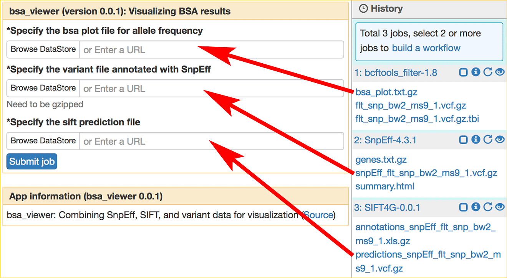

|CyVerse logo|_

|Home_Icon|_
`Learning Center Home <http://learning.cyverse.org/>`_


The Bulked Segregant Analysis Tutorial
---------------------------
This tutorial is a step-by-step guide for using SciApps to perform Bulked segregant analysis. The example data used here is from studying the sorghum Ms9 gene, located in chromosome 2, which encodes a PHD-finger transcription factor critical for pollen development (`reference <https://dl.sciencesocieties.org/publications/tpg/articles/0/0/190020>`_). The ms9 mutant plants (right in the image) are crossed by the WT BTx623 pollen (left) to generate the F1 seeds. The F1 plants produced F2 seeds through self-fertilization. Leaf tissues from 20 confirmed F2 mutants are pooled, quality-checked, and subjected to 150-bp paired-end sequencing on an illumina X-10 instrument. 
 
    |sorghum_ms9|

To reduce the computation time, reads from chromosome 2 are extracted and downsampled to 50%. To further reduce the computation time, we start the tutorial with variant calling from the alignment file by skipping the alignment of raw reads with Bowtie2. We will call SNPs with bcftools, then filter the resulted SNPs by the EMS mutation type (G to A or C to T), read depth, background, and minimum allele frequency. SnpEff is used to annotate the filtered SNPs during the filtering step. 

An interactive visualization interface is available with the filtered results to confirm whether the candidate genes are true or false positives. We use SIFT to further filter out genes that contain just non-significant mutations. Then, at the last, we use Ensembl Plants/Gramene to locate EMS pools that contain different alleles on the candidate gene for further verification.

----

**Example Data**

.. list-table::
    :header-rows: 1

    * - Input
      - Description
      - Example
    * - Raw reads
      - Downsampled reads for chromosome 2
      - `ms9_chr2_1.fq.gz <http://datacommons.cyverse.org/browse/iplant/home/sciapps/ems/ms9_chr2_1.fq.gz>`_, `ms9_chr2_2.fq.gz <http://datacommons.cyverse.org/browse/iplant/home/sciapps/ems/ms9_chr2_2.fq.gz>`_
    * - Alignments
      - Alignment of raw reads to Sorghum V3 assembly
      - `bw2_ms9_chr2_1.bam <https://data.cyverse.org/dav-anon/iplant/home/lwang/sci_data/results/Bowtie2-2.3.2_86263a4a-c7d2-4f56-a4d9-e44d8ac4bf9f/bw2_ms9_chr2_1.bam>`_
    * - Variants
      - Variants called with bcftools
      - `flt_bw2_ms9_chr2_1.vcf.gz <https://data.cyverse.org/dav-anon/iplant/home/lwang/sci_data/results/bcftools_call_cshl-1.2_7947bafe-e270-48ea-b081-489b3d07fc48/flt_bw2_ms9_chr2_1.vcf.gz>`_

**Apps:**

.. list-table::
    :header-rows: 1

    * - App name
      - App link
      - Description
      - Notes/other links
    * - Bowtie2
      - `Bowtie2-2.3.2 <https://www.sciapps.org/app_id/Bowtie2-2.3.2>`_
      - Fast and sensitive read alignment
      - `Bowtie2 documentation <http://bowtie-bio.sourceforge.net/bowtie2/manual.shtml>`_
    * - bcftools_call_cshl
      - `bcftools_call_cshl-1.2 <https://www.sciapps.org/app_id/bcftools_call_cshl-1.2>`_
      - SNP/indel calling
      - `bcftools documentation <http://www.htslib.org/doc/bcftools-1.2.html>`_
    * - ems_filter-1.2
      - `ems_filter-1.2 <https://www.sciapps.org/app_id/ems_filter-1.2>`_
      - Filter EMS SNP in F2 from background and run SnpEff
      - `SnpEff documentation <http://snpeff.sourceforge.net/SnpEff.html>`_
    * - SIFT4G
      - `SIFT4G-0.0.1 <https://www.sciapps.org/app_id/SIFT4G-0.0.1>`_
      - A faster version of SIFT that predicts whether an amino acid substitution affects protein function
      - `SIFT4G documentation <https://sift.bii.a-star.edu.sg/sift4g/>`_

*Step 1: Requiring access to SciApps*
~~~~~~~~~~~~~~~~~~~~~~~~~~~~~~~~~~~~~~
This is one-time operation. Please login to `SciApps <https://www.SciApps.org/>`_ directly if you have completed this step before.

  1. Log into CyVerse User portal at https://user.cyverse.org.

  2. By default, you will be under the 'Services' page, click on 'AVAILABLE', then 'REQUEST ACCESS' to SciApps.

     |cyverse_user|

  3. Click on 'MY SERVICES', then click on 'LAUNCH' for Discovery Environment.

  4. Once in Discovery Environment, click to open the 'Data' window. You should see the **sci_data** folder under your root folder:/iplant/home/YOUR_USER_NAME.

     |de_data|

----

*Step 2: Uploading data for SciApps*
~~~~~~~~~~~~~~~~~~~~~~~~~~~~~~~~~~~~
This step will demo how to upload data to the sci_data folder for accessing from SciApps.

   1. Click **sci_data** folder to open it.

   2. Click 'Upload', then 'Import from URL' to import this URL: https://data.cyverse.org/dav-anon/iplant/home/lwang/sci_data/results/Bowtie2-2.3.2_86263a4a-c7d2-4f56-a4d9-e44d8ac4bf9f/bw2_ms9_chr2_1.bam

      |url_window|

      .. Note::
        This may take a few minutes. You can check the status by clicking the 'Bell' on the top right corner of DE. Once importing completed, 'Refresh' the window to see the file. This is an alignment file in bam format from aligning the raw reads to Sorghum v3 assembly.
  
   3. Alternatively, use `Cyberduck <https://pods.iplantcollaborative.org/wiki/display/DS/Using+Cyberduck+for+Uploading+and+Downloading+to+the+Data+Store>`_ or `iCommands <https://pods.iplantcollaborative.org/wiki/display/DS/Using+iCommands>`_ for bulk data transfer to the sci_data folder.


*Step 3: Variant calling with bcftools*
~~~~~~~~~~~~~~~~~~~~~~~~~~~~~~~~~~~~~~~~~~~~~~~~~
This step will take less than 15 minutes with the example data. A compressed vcf file will be generated once done.

  1. Login to SciApps at https://www.SciApps.org.

  2. Click **Variant analysis** category (left panel) to find or search for **bcftools**, then click to load **bcftools_call_cshl-1.2**.

  3. Under “Select bam file”, click **Browse DataStore**, then navigate to the **sci_data** folder (home) or where you imported the bam file; select the bam file and click 'Select and Close'.

     |bcftools_window|

     .. Tip::
       Click 'Refresh' if you can not see any newly uploaded files. 

  4. Under "Or select the genome hosted by SciApps:", choose **Sorghum bicolor (Sorbi3)**.

  5. Leave other parameters as default, and click **Submit Job**. You will be asked to confirm; click "Submit". You will be prompted to check the job status in the right panel. Once COMPLETED, move on to the next step.
       

*Step 4: Filtering and annotating with ems_filter (and SnpEff)*
~~~~~~~~~~~~~~~~~~~~~~~~~~~~~~~~~~~~~~~~~~~~~~~~~~~~~~~~~~~~~~~~~
This step will filter the called SNPs and annotate them with SnpEff.

  1. Click **Variant analysis** category (left panel) to find or search for **ems_filter**, then click to load **ems_filter-1.2**.

  2. Click **bcftools_call_cshl-1.2** in the History panel to expand its outputs, then
     drag and drop **flt_bw2_ms9_chr2_1.vcf.gz** into the **Select the gzipped VCF file for filtering:** field.

     |ems_filter|

  3. Leave others as defaults, then click the "Submit Job" button.

  4. Once COMPLETED, click the **Visualization** 'eye' icon for **ems_filter-1.2** in the History panel to bring up its outputs. Select **vaf_plot.view.tgz** from the list of outputs, then click **Visualize**, you will be directed to a visualization interface built with `Shiny <https://shiny.rstudio.com/>`_. The vaf plot displays the allele frequency at each loci. The non_synonymous SNPs are marked as red circles in the plot, and displayed in the table with the associated gene ids and other information.

     |ems_view|

     .. Warning::
        The Variant Allele Frequency (vaf) plot will be displayed in a new window, so please check if pop-ups from SciApps are blocked by your web browser.

     .. Note::
        The example here is using chromosome 2 only. And the vaf plot is pre-configured to display chromosome 2 of sorghum bicolor (BTx623). For your own data, check the list of genes below the plot and use the options on the left side to select a specific chromosome if there are SNPs detected on them.

     .. Tip::
        You can use the sliding bar to change the smoothness of the fitted curve. Click near the non_synonymous SNP will filter the table with nearby genes only. To reload all genes, simply refresh the page.
     
  5. The candidate SNP at 2:41903129 is detected because we set the minimum allele frequency (maf) as no smaller than 0.9 in Step 4 (2). The SNP won't be detected if maf is set as 1, which increases the chance of missing the true candidate genes if there is sequencing or phenotyping error in the data. 

     .. Note::
        The vaf plot shows that the candidate SNP at 2:41903129 might be a false positive since it is not located on a 'peak', which represents a mutant segment of the chromosome when crossover the mutant line with BTx623. However, when the smoothing parameter is set as 0.1, a small peak can be detected right under the SNP.


     .. Note::
        Check the `vcf plot <https://data.sciapps.org/shiny/vaf-plot/?inp_file=vi/ems_filter-1.2_b5998c1d-66d6-4c4d-9b78-064220d639b6/vaf_plot>`_ of the full dataset, with all chromosomes and no downsampling.
  
*Step 5: Filtering candidate genes with SIFT*
~~~~~~~~~~~~~~~~~~~~~~~~~~~~~~~~~~~~~~~~~~~~~~~~
There are 7 candidate SNPs (falls on 6 candidate genes) identified in the last step. The SNP at 2:61271277 disrupts the splice site acceptor and is a deleterious mutation. For the other 6 non-synonymous SNPs, we can use SIFT to predict whether they will alter the encoded protein function.

  1. Click **Variant analysis** category (left panel) to find or search for **SIFT4G**, then click to load **SIFT4G-0.0.1**. 

  2. Click **ems_filter-1.2** in the History panel to expand its outputs, then drag and drop **ems_flt_bw2_ms9_chr2_1.vcf.gz** into the **Specify the variant file** field.

  3. Under "Specify the species (-d)", choose **Sorghum bicolor (Sorbi3)**.

  4. Leave other parameters as default, and click **Submit Job**. Once done, click the SIFT4G-0.0.1 job in the History panel to expand the outputs, then click to open **sift_out.txt**. As shown below, only two out of the six SNPs are predicted to be deterious. 

     |sift_out|

     .. Note:: SIFT score ranges from 0 to 1. The amino acid substitution is predicted damaging if the score is <= 0.05, and tolerated if the score is > 0.05.
      
*Step 6: Finding mutant lines with the same candidate gene using Ensembl Plants/Gramene*
~~~~~~~~~~~~~~~~~~~~~~~~~~~~~~~~~~~~~~~~~~~~~~~~~~~~~~~~~~~~~~~~~~~~~~~~~~~~~~~~~~~~~~~~~~~~~~~~
With three candidate genes left from the last filtering step, Sb02g026200(Sobic.002G221000, or SORBI_3002G221000) looks promising since it encodes a PHD-finger transcription factor that is critical for pollen development in Arabidopsis (`reference <https://onlinelibrary.wiley.com/doi/full/10.1046/j.1365-313X.2001.01125.x>`_). There is an EMS SNP database available at Ensembl Plants/Gramene. With the database, we can find the mutant lines that carry the different mutations in the same gene, acquire the seeds, plant and check the phenotype.

  1. Go to `Ensembl Plants <http://plants.ensembl.org/index.html>`_.

  2. Select **Sorghum bicolor** under "All genomes".

  3. Search for **SORBI_3002G221000** and click **SORBI_3002G221000** to open the gene page.
 
  4. Click **Variant table** under "Genetic Variation" from the left panel.

  5. Filter SNPs by SIFT score <= 0.05 to find that SNP **tmp_2_61310404_C_T** is the only one left. Click **tmp_2_61310404_C_T** to open the Variant page.

  6. Click **247 sample genotypes** (in the six-row). Then sort the **Genotype** twice or until seeing **C|T** as the first one. The mutation is from the EMS pool named **ARS178**. 


*Summary*
~~~~~~~~~

This tutorial covers how to use SciApps for Bulked segregant Analysis, including accessing data in CyVerse Data Store, launching jobs, visualizing results, and using Ensembl Plants/Gramene to find the mutant lines that carry different mutations in the same gene.


More help and additional information
`````````````````````````````````````

..
    Short description and links to any reading materials

- `Efficient Identification of Causal Mutations through Sequencing of Bulked F2 from Two Allelic Bloomless Mutants of Sorghum bicolor <https://www.frontiersin.org/articles/10.3389/fpls.2017.02267/full>`_

----

**Fix or improve this documentation:**

- On Github: `Repo link <https://github.com/CyVerse-learning-materials/SciApps_guide/blob/master/bsa.rst>`_
- Send feedback: `support@SciApps.org <support@SciApps.org>`_

----

  |Home_Icon|_
  `Learning Center Home <http://learning.cyverse.org/>`_

.. |CyVerse logo| image:: ./img/cyverse_rgb.png
    :width: 500
    :height: 100
.. _CyVerse logo: http://learning.cyverse.org/
.. |Home_Icon| image:: ./img/homeicon.png
    :width: 25
    :height: 25
.. _Home_Icon: http://learning.cyverse.org/

.. |de_data| image:: ./img/sci_apps/de_data.gif
    :width: 660
    :height: 370
.. |url_window| image:: ./img/sci_apps/url_window.gif
    :width: 660
    :height: 431
.. |bcftools_window| image:: ./img/sci_apps/bcftools_window.gif
    :width: 660
    :height: 456
.. |status| image:: ./img/sci_apps/status.gif
    :width: 250
    :height: 60
.. |agave_status| image:: ./img/sci_apps/agave_status.gif
    :width: 550
    :height: 322
.. |cyverse_user| image:: ./img/sci_apps/cyverse_user.gif
    :width: 660
    :height: 362



.. |workflow_URL| image:: ./img/sci_apps/workflow_URL.gif
    :width: 582
    :height: 182
