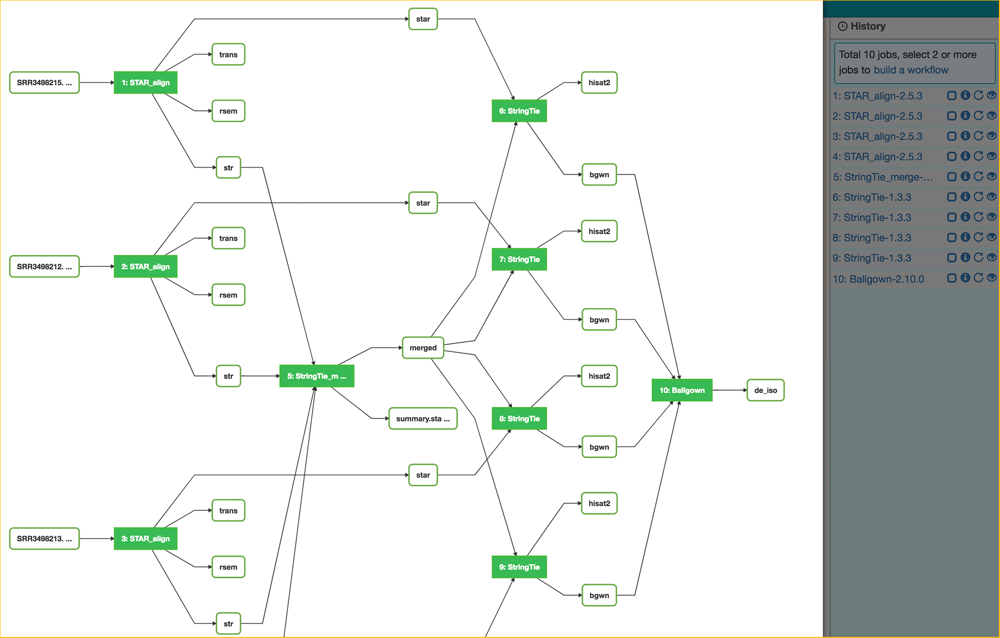

|CyVerse logo|_

|Home_Icon|_
`Learning Center Home <http://learning.cyverse.org/>`_

Accessing MaizeCODE Data
----------------------------

Customized apps (e.g. `MCRNAseq-0.0.1 <https://www.sciapps.org/app_id/MCRNAseq-0.0.1/>`_) are built to perform QC and preliminary quantifications on the MaizeCODE raw RNAseq and RAMPAGE data. For each MaizeCODE experiment, the analysis of all replicates are saved as a SciApps workflow (with a unique ID), which records the relationship between raw reads and their derived results. Following sections illustrate the details about the MCRNAseq app, how users can check the QC results of any MaizeCODE experiments, as well as using the preliminary results for performing downstream differential expression analysis between any two tissues.

----

*The MCrna App*
~~~~~~~~~~~~~~~~~~~~~~~~~~~~~~~~~~~~~~~~~~~~~~~~~~~~~
 
The MCrna app wraps six tools, FastQC, bbduk, MultiQC, STAR, RSEM, and StringTie, together for QC and quantification of each replicate of an RNAseq (or RAMPAGE) experiment. The order of running these tools for processing one MaizeCODE RNA-seq experiment (two replicates) is shown below. 

 |MCRNAseq|

For each replicate, raw read files are preprocessed by `bbduk <https://jgi.doe.gov/data-and-tools/bbtools/bb-tools-user-guide/bbduk-guide/>`_ to remove low quality portion of the read and adapter contaminations. `FastQC <http://www.bioinformatics.babraham.ac.uk/projects/fastqc/>`_ is then used to do quality check for both raw and processed reads, and FastQC results are summarized by `MultiQC <https://multiqc.info/>`_ into a HTML formatted report. The trimmed reads are aligned to the reference genome with `STAR <https://github.com/alexdobin/STAR>`_, then the alignment file is used to quantify the expression of each gene with `RSEM <https://deweylab.github.io/RSEM/>`_ and to assemble transcripts with `StringTie <https://ccb.jhu.edu/software/stringtie/>`_.

The results of the MCrna app include the MultiQC report, the gene quantification file, the browser track signals, the alignments, and the assembled transcripts, all stored in the CyVerse cloud; therefore, they are ready for being visualized or used in downstream analysis (see more details below).

----

*Load a MaizeCODE RNAseq Experiment*
~~~~~~~~~~~~~~~~~~~~~~~~~~~~~~~~~~~~~~~~~~~~~~~~~~~~~

In above section, we explained the MCrna app/module used in processing RNAseq/RAMPAGE data. Here we will show how to locate a specific experiment/workflow (e.g. 'RNAseq for B73 root') and load it on SciApps.org to examine outputs, parameters used, inputs, and associated metadata.
 
  1. Open https://www.SciApps.org, click **Data** (top menu) then **MaizeCODE**. Alternatively, you can access MaizeCODE experiments directly at https://www.SciApps.org/data/MaizeCODE to browse the list of workflows shown below:

     |MaizeCODE|

    .. Note::

       Five operations are supported for a selected workflow (by checking the radio button before it):
   
       - 'Relaunch': Display filled app forms in the main panel
       - 'Visualize': Display workflow diagram and load job histories to the right panel
       - 'Load': Load job histories to the right panel
       - 'Share': Get a direct link to the workflow for sharing
         |workflow_URL|
       - 'Metadata': Display the experimental metadata associated with the workflow

  2. Locate an experiment by searching with keyword (e.g., 'B73 root')

    .. note::
       
       Experiments can also be located by searching with a workflow id (e.g. '74c29d16-132b-40a8-a50b-71a324613a5a' for B73 root RNAseq experiment).

  3. Select (or check) the experiment (e.g., MC_B73_B73v4_root_RNAseq), then click **load** to load analysis results into the History panel. The results of the RNAseq workflow/experiment for B73 root tissue are shown below, with outputs of the first job/replicate expanded by clicking the job name. Results include MultiQC report, gene quantification file (with prefix 'rsem'), forward ('sig_f') and backward ('sig_r') browser track signals, alignment file and index (.bam, .bam.bai), and assembled transcripts in gtf format.

     |MCRNAres|

     .. Note::

        From left to right, there are four icons next to each job name:

        - **Checkbox**: If checked, the job will be added to the workflow building page (if loaded).
        - **Information**: More about the status of the analysis job and link to the output folder.
        - **Relaunch**: Load the app form filled with inputs and parameters used before.
        - **Visualization**: Generate URLs for visualizing in a web Browser (e.g., .html, .txt, .jpg) or Genome Browser (e.g., .bw, .bam, .gtf).

  4. Click the Visualization ('eye' shaped) icon next to the job name to bring up the visualization panel shown below. You can select a file (by checking the radio button before it), then get URLs of output files (as shown below for the bam file) for genome browsers.

     |MCrna_URL|

     .. Warning::
        If clicking on **Visualize** (when multiqc_report.html file is selected), the file  will be displayed in a new tab of your web browser window, so please check if pop-ups from SciApps are blocked by your browser and disable it if needed.

  5. To add the URL you got from the last step to the SciApps JBrowse, click **Tools** (from SciApps top menu), then **JBrowse** to load JBrowse. As shown below, select 'Maize B73v4', click **File** and **Open track file or URL**, then paste the URLs under **Remote URLs - one per line** (not shown). For displaying alignments, you need add URLs for both the bam and index (.bai) files. 

     |jbrowse_add|

----

*Find differentially expressed genes*
~~~~~~~~~~~~~~~~~~~~~~~~~~~~~~~~~~~~~~~~~~~~~~~~

An an example, to find genes that are expressed differently between root and ear tissues of B73, simply follow these steps.

  1. Log into SciApps at https://www.SciApps.org/ before submitting any analysis jobs.

     .. Warning::
        Make sure you have followed `this instruction <https://cyverse-sciapps-guide.readthedocs-hosted.com/en/latest/step2.html>`_ to enable 'SciApps service' from the CyVerse user portal. Otherwise your job will fail at the archiving step.

  2. From the `MaizeCODE data page <https://www.SciApps.org/data/MaizeCODE>`_, search 'B73 ear' and 'B73 root' to find then load each experiment into the History panel, as shown in the last section.

  3. Search 'RSEM_de' or directly locate the  **RSEM_de-1.3.0** app under the **Comparison** category in the left **Apps** panel. Click to load the app form. 

     |de_analysis|

  4. As shown above, for each replicate, drag and drop the gene quantification result (filenames starting with “rsem”) into the input field, then click the “Submit job” button to run the differential expression analysis. A new job will appear in the History panel and it only take a few minutes to get the list of differentially expressed genes back since alignments and gene quantifications are already done and archived in the cloud.

     .. Note::
        Use the '+ Insert' and '- Remove' button to add/remove the number of input fields, based on the number of replicates available.  

  5. When the job is completed (when the visualization or eye-shaped button is no longer grayed out), click the output file name (deg_GeneMat.de.txt) to preview the result, as shown below.

     |de_result|

     .. Note::
        Each line describes a gene and contains 7 fields: the gene name, posterior probability of being equally expressed (PPEE), posterior probability of being differentially expressed (PPDE), posterior fold change of Sample 1 over Sample 2 (PostFC), real fold change of Sample 1 over Sample 2 (RealFC), mean count of Sample 1 (C1Mean) and mean count of Sample 2 (C2Mean). For fold changes, PostFC is recommended over the RealFC. For more details, please check `this tutorial <https://github.com/bli25broad/RSEM_tutorial>`_. 

----

*Find differentially expressed isoforms*
~~~~~~~~~~~~~~~~~~~~~~~~~~~~~~~~~~~~~~~~~~~~~~~~

As an example, in this section we will use differential isoform expression analysis to demonstrate how to leverage SciApps workflows and apps to perform downstream analysis with the MaizeCODE data. We will start with examining a public isoform analysis workflow (step 1), construct a new workflow from the public workflow (since we don't want to repeat the alignment with STAR and transcript assembly with StringTie, already completed with running the MCrna app), then run the newly constructed workflow with pre-processed MaizeCODE data.

  1. Click **Workflow**, **Public workflows**, then select **RNA-seq2** to 'Visualize' the workflow, which will also load job histories into the History panel, as shown below. The workflow uses the `STAR_align-2.5.3 <https://www.sciapps.org/?app_id=STAR_align-2.5.3>`_ app which is similar with the `MCrna-0.0.1 <https://www.sciapps.org/?app_id=MCrna-0.0.1>`_ app except that it does not trim the read or generate the QC report. The assembled transcripts are merged with the `StringTie_merge-1.3.3 <https://www.sciapps.org/?app_id=StringTie_merge-1.3.3>`_ app, then passed along with the STAR alignment file to the `StringTie-1.3.3 <https://www.sciapps.org/?app_id=StringTie-1.3.3>`_ app for a second round transcript assebmly, before calling the `Ballgown-2.10.0 <https://www.sciapps.org/?app_id=Ballgown-2.10.0>`_ app for finding differentially expressed isoforms.   

     |iso_workflow|

     .. Note::
        The green button on the workflow diagram (representing each job) is numbered consistently with the order of jobs in the history panel.

  2. In this step, we will construct a new workflow by removing the STAR_align steps from the above workflow. As shown below, this is done by checking jobs 5-10 and clicking on the 'build a workflow' link above the jobs. The diagram of the new workflow is shown below. Save it as your private workflow to load it back later.

     |iso_build|

     .. Note::
        The diagram shows that we need to feed the assembled transcripts (filenames starting with 'str') to the `StringTie_merge-1.3.3 <https://www.sciapps.org/?app_id=StringTie_merge-1.3.3>`_ app, and alignments to the `StringTie-1.3.3 <https://www.sciapps.org/?app_id=StringTie-1.3.3>`_ app. All inputs are available from the MaizeCODE experiment.

  3. Follow instructions above to load both B73 root and ear experiments into the History panel.

  4. Go to **Workflow**, **My workflows** to load the newly saved workflow.

     .. Note::
        You might need to check twice to see the new workflow (check 'Home' then back to 'My workflows'), which should be the fisrt one in the list.

  5. As shown below, clear the input fields for step 1, then drag and drop transcript outputs (filenames starting with 'str') into the input fields. Also need to set the 'Select the staged annotation file' as 'Zea mays (AGPv4)' for step 1-5. 
 
     |iso_analysis|

     .. Note::

        Scroll down the app forms, then drag and drop the alignment file (*.bam) into step 3, 4, 2, 5 as shown above. The order is determined by the input fields of step 6, as shown below (Sample 1 has step 3 and 4, Sample 2 has step 2 and 5).

        |iso_analysis2|

     .. Warning::
        Make sure to clear the input field before dragging and dropping new input. Make sure you have set the 'Select the staged annotation file' as 'Zea mays (AGPv4)' for step 1-5.

  6. Submit the workflow and the workflow diagram with live status will be shown as below.

     |iso_run|

     .. Note::
        Different colors of the app button represent different status: blue (running), yellow (pending), green (completed), and red (failed). Depending on the size of input files to be staged and queue status of computing cluster, it might take a while for the status to get updated. You can save the workflow and check the status later by visualizing the diagram.

  7. When the workflow is completed (when all app buttons are green), click Ballgown's output filename (de_iso.tsv) to preview the result, as shown below. 

     |ballgown_out|

     .. Note:: Each line describes a transcript and contains 7 fields: the gene name, the gene ID, feature, row id, fold change, the p-value, and the q-value for differential expression. For more details, please check `this tutorial <https://www.ncbi.nlm.nih.gov/pmc/articles/PMC5032908/>`_.

----

*Summary*
~~~~~~~~~~
This tutorial covers how to use SciApps to access MaizeCODE data and use them for downstream analysis, including describing the details of the MCrna app, loading an RNAseq experiment to access its outputs, running differential expression analysis at both the gene and transcript (isoform) level. By storing MaizeCODE data and analysis results in the cloud, all downstream analysis can be completely in a timely fashion by any community users. 
        

----

**Fix or improve this documentation:**

- On Github: `Repo link <https://github.com/CyVerse-learning-materials/SciApps_guide/blob/master/step2.rst>`_
- Send feedback: `Tutorials@CyVerse.org <Tutorials@CyVerse.org>`_

----

  |Home_Icon|_
  `Learning Center Home <http://learning.cyverse.org/>`_

.. |CyVerse logo| image:: ./img/cyverse_rgb.png
    :width: 500
    :height: 100
.. _CyVerse logo: http://learning.cyverse.org/
.. |Home_Icon| image:: ./img/homeicon.png
    :width: 25
    :height: 25
.. _Home_Icon: http://learning.cyverse.org/
.. |data_window| image:: ./img/sci_apps/data_window.gif
    :width: 582
    :height: 264
.. |cyverse_user| image:: ./img/sci_apps/cyverse_user.gif
    :width: 660
    :height: 362
.. |sciapps_launch| image:: ./img/sci_apps/sciapps_launch.gif
    :width: 550
    :height: 172

.. |workflow_URL| image:: ./img/sci_apps/workflow_URL.gif
    :width: 582
    :height: 182

