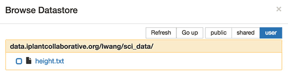
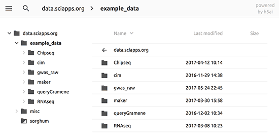

|CyVerse logo|_

|Home_Icon|_
`Learning Center Home <http://learning.cyverse.org/>`_

Viewing and Accessing Data
--------------------------

SciApps uses CyVerse Data Store for user data management. After logging into SciApps with your CyVerse credentials, you get permission to read from a special directory in your Data Store named "sci_data". If you put files into that directory, you can see them on SciApps and use them for analysis. You can use `Discovery Environment <https://learning.cyverse.org/projects/discovery-environment-guide/en/latest/>`_ for uploading smaller files (< 1.9 GB) to your Data Store.

----

*Navigating Data on SciApps*
~~~~~~~~~~~~~~~~~~~~~~~~~~~~~~~~~~~~~~~~~~~~~~~~~~~~~~~~~~~~~~~~~~~

  1. Logging into SciApps at https://www.SciApps.org

  2. Enable 'SciApps' service in `CyVerse User portal <https://user.cyverse.org/>`_ (one time operation)
  
    .. Tip::
      You can check if you already have SciApps service by logging into the portal and visiting the 'My Service' page. If SciApps is not listed, click on 'Available services' to request access. Once enabled, A sci_data folder will be created in your Data Store root folder 

  3. Load any app form by clicking on an app name in the left panel, then click on 'or Browse DataStore' to open the browsing window
  
    .. Tip::
      Through authentication, your CyVerse username is captured to direct SciApps to the sci_data folder of the user being logged in, as shown below for user lwang
  
      |data_window|
  
      The other tabs include:
  
      - ‘public’: Example data used for public workflows
      - ‘shared’: CyVerse’s public data hosted in CyVerse Data Store
      - 'Go up': Move up one level
      - 'Refresh': Reload current folder

----

*Accessing Data on SciApps*
~~~~~~~~~~~~~~~~~~~~~~~~~~~~~~~~~~~~~~~~~~~~~~~~~~~~~~~~~~~~~~~~~~~
  1. Access SciApps at https://www.SciApps.org
  
  2. Click on ‘Data’ (from the top navigation bar), you will be directed to the SciApps data page
  
    .. Note::
      Only public data (example_data) is available on the data page. Analysis results will also be accessible here with random folder names (hidden for security reasons)
    
      |data_web|
----

**Fix or improve this documentation:**

- On Github: `Repo link <https://github.com/CyVerse-learning-materials/SciApps_guide>`_
- Send feedback: `Tutorials@CyVerse.org <Tutorials@CyVerse.org>`_

----

.. |CyVerse logo| image:: ./img/cyverse_rgb.png
    :width: 500
    :height: 100
.. _CyVerse logo: http://learning.cyverse.org/
.. |Home_Icon| image:: ./img/homeicon.png
    :width: 25
    :height: 25
.. _Home_Icon: http://learning.cyverse.org/

