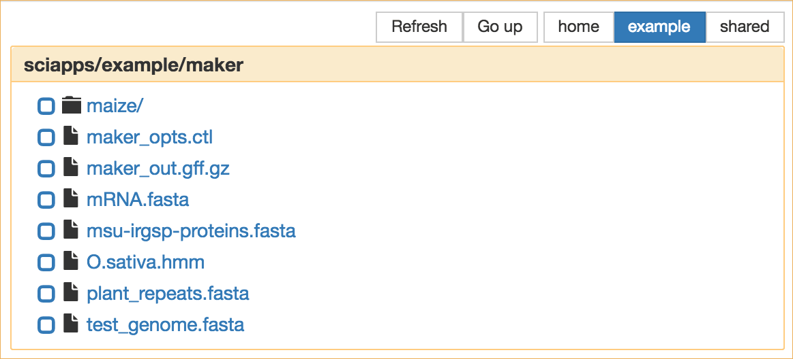

|CyVerse logo|_

|Home_Icon|_
`Learning Center Home <http://learning.cyverse.org/>`_

Viewing and Accessing Data
--------------------------

SciApps uses `CyVerse Data Store <https://cyverse-data-store-guide.readthedocs-hosted.com/en/latest/>`_
for user data management. After logging into SciApps with your CyVerse
credentials, a folder called **sci_data** will be created in your Data Store.
If you put files into that directory, you can see them on SciApps and use them
for analysis.

----

*Browsing/Navigating CyVerse Data Store on SciApps*
~~~~~~~~~~~~~~~~~~~~~~~~~~~~~~~~~~~~~~~~~~~~~~~~~~~~~

  1. Log into CyVerse User portal at https://user.cyverse.org.

  2. By default, you will see 'My SERVICES'. If SciApps is not listed, click on 'AVAILABLE', then 'REQUEST ACCESS'.

     |cyverse_user|

     .. Note::

       Once requested, SciApps will create the **sci_data** folder in your Data Store home folder. Any data you put in this folder can be used to build workflows. The REQUEST step is one-time operation, and after this, you can log into SciApps directly at https://www.SciApps.org.

  3. If SciApps is listed, click on 'LAUNCH'.

     |sciapps_launch|

  4. Load any App form by clicking on an App name in the left panel. For any steps that require an input, click '**or Browse DataStore**' to open the browsing window.

     .. tip::

       Click on **CyVerse** to browse the CyVerse Data Store (**sci_data** folder only):

       |data_window|

       Other tabs include:

       - **exampleData**: Example data used for public workflows
       - **Go up**: Move up one level
       - **Refresh**: Reload current folder

----

*Accessing Data on SciApps*
~~~~~~~~~~~~~~~~~~~~~~~~~~~~~
  1. Access SciApps at https://www.SciApps.org.

  2. Click on ‘Data’ (from the top navigation bar), you will be directed to the
     SciApps data page.

     .. Note::
       Only exampleData (example_data) is available on the data page. 

       |data_web|
----

**Fix or improve this documentation:**

- On Github: `Repo link <https://github.com/CyVerse-learning-materials/SciApps_guide/blob/master/step2.rst>`_
- Send feedback: `Tutorials@CyVerse.org <Tutorials@CyVerse.org>`_

----

  |Home_Icon|_
  `Learning Center Home <http://learning.cyverse.org/>`_

.. |CyVerse logo| image:: ./img/cyverse_rgb.png
    :width: 500
    :height: 100
.. _CyVerse logo: http://learning.cyverse.org/
.. |Home_Icon| image:: ./img/homeicon.png
    :width: 25
    :height: 25
.. _Home_Icon: http://learning.cyverse.org/

.. |data_web| image:: ./img/sci_apps/data_web.gif
    :width: 550
    :height: 295
.. |cyverse_user| image:: ./img/sci_apps/cyverse_user.gif
    :width: 660
    :height: 362
.. |sciapps_launch| image:: ./img/sci_apps/sciapps_launch.gif
    :width: 550
    :height: 172
