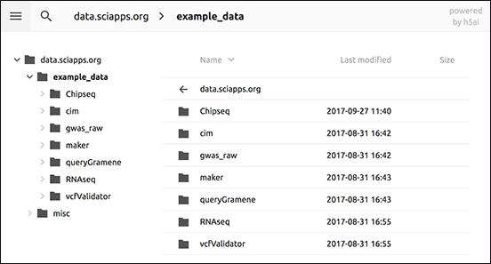

|CyVerse logo|_

|Home_Icon|_
`Learning Center Home <http://learning.cyverse.org/>`_

Viewing and Accessing Data
--------------------------

SciApps uses `CyVerse Data Store <https://cyverse-data-store-guide.readthedocs-hosted.com/en/latest/>`_
for user data management. After logging into SciApps with your CyVerse
credentials, a folder called **sci_data** will be created in your Data Store.
If you put files into that directory, you can see them on SciApps and use them
for analysis.

----

*Browsing/Navigating CyVerse Data Store on SciApps*
~~~~~~~~~~~~~~~~~~~~~~~~~~~~~~~~~~~~~~~~~~~~~~~~~~~~~

  1. Log in into SciApps at `https://www.SciApps.org <https://www.SciApps.org>`_

     .. Tip::

       Ensure you have access to SciApps by logging into the `CyVerse User portal <https://user.cyverse.org/>`_
       You can check if you already have SciApps service by logging into the
       portal and visiting the 'My Service' page. If SciApps is not listed,
       click on 'Available' to request access. Requesting access is a
       one-time operation.

       Once enabled, SciApps will create a A **sci_data** folder in your Data Store home folder.

  2. Load any App form by clicking on an App name in the left panel. For any
     step that requires a file in put, click 'or Browse DataStore' to open
     browse the Data Store.

     .. tip::

       You can browse the files in your Data Store SciApps has access to:

       |data_window|

       Other tabs include:

       - **public**: Example data used for public workflows
       - **shared**: CyVerse’s public data hosted in CyVerse Data Store
       - **Go up**: Move up one level
       - **Refresh**: Reload current folder

----

*Accessing Data on SciApps*
~~~~~~~~~~~~~~~~~~~~~~~~~~~~~
  1. Access SciApps at https://www.SciApps.org

  2. Click on ‘Data’ (from the top navigation bar), you will be directed to the
     SciApps data page

     .. Note::
       Only public data (example_data) is available on the data page. Analysis
       results will also be accessible here with random folder names
       (hidden for security reasons)

       |data_web|
----

**Fix or improve this documentation:**

- On Github: `Repo link <https://github.com/CyVerse-learning-materials/SciApps_guide>`_
- Send feedback: `Tutorials@CyVerse.org <Tutorials@CyVerse.org>`_

----

.. |CyVerse logo| image:: ./img/cyverse_rgb.png
    :width: 500
    :height: 100
.. _CyVerse logo: http://learning.cyverse.org/
.. |Home_Icon| image:: ./img/homeicon.png
    :width: 25
    :height: 25
.. _Home_Icon: http://learning.cyverse.org/
.. |data_window| image:: ./img/sci_apps/data_window.gif
    :width: 500
    :height: 200

