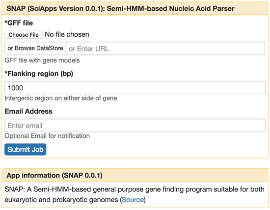
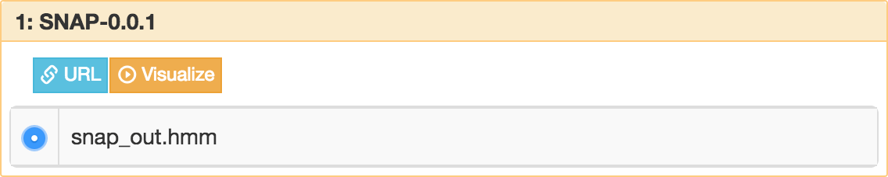
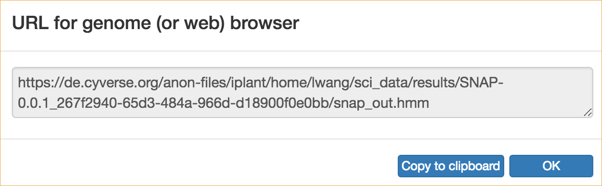

|CyVerse logo|_

|Home_Icon|_
`Learning Center Home <http://learning.cyverse.org/>`_

Launching an Analysis Job
----------------------------------

For analyzing data, you can select an App from the left panel of SciApps.
In this example, to cover the minimum you need to launch an analysis, we will
use `SNAP <https://github.com/KorfLab/SNAP>`_, a gene finding app, to estimate
Hidden Markov Model (HMM) parameters with a GFF file output from MAKER, an
annotation App.

----

.. #### Comment: short description

**Example Data**

.. list-table::
    :header-rows: 1

    * - Input
      - Description
      - Example
    * - Annotated gene models
      - MAKER output in GFF3 format
      - `maker_out.gff.gz <http://datacommons.cyverse.org/browse/iplant/home/sciapps/example/maker/maker_out.gff.gz>`_

**Apps:**

.. list-table::
    :header-rows: 1

    * - App name
      - Version
      - Description
      - App link
      - Notes/other links
    * - SNAP
      - 0.0.1
      - Semi-HMM-based Nucleic Acid Parser
      - `SNAP-0.0.1 <https://www.sciapps.org/app_id/SNAP-0.0.1>`_
      - `SNAP documentation <http://korflab.ucdavis.edu/software.html>`_

*Example Analysis: HMM parameters estimation with SNAP*
~~~~~~~~~~~~~~~~~~~~~~~~~~~~~~~~~~~~~~~~~~~~~~~~~~~~~~~~~~~~~~~~~

  1. Login to SciApps at https://www.SciApps.org.

  2. Click **Prediciton** category (left panel) or search for **SNAP**, then click **SNAP** to load **SNAP-0.0.1**.

  3. Under “GFF file” click **Browse DataStore**, then navigate the example folder
     (*example > maker*); select **maker_out.gff.gz** and click
     'Select and Close'.

     |snap_app|

  4. Leave other parameters as default, and then click **Submit Job**. You will
     be asked to confirm; click "Submit". You will be prompted to check the job
     status in the right panel.
       
     .. Tip::
       In the right panel, each analysis job is designated with a number and an
       App id (e.g. 1: SNAP-0.0.1). Outputs (e.g. snap_out.hmm) are displayed after
       clicking the job name and job status is displayed after clicking the (i)
       icon.
       
       |status|
       
       From left to right, there are four icons next to each job name:

       - **Checkbox**: If checked, the job will be added to the workflow building page (if loaded).
       - **Information**: More about the status of the analysis job and link to the output folder (for an example, check the screenshot below).
         |agave_status|
       - **Relaunch**: Load the app form filled with the inputs and parameters used before.
       - **Visualization**: Generate URLs for visualizing in a Genome Browser or Web Browser (e.g. .bw, .bam, .gtf).

     .. Tip::
       If a job is failed, you can try to debug it with the .err file and .out file in the output folder.

     .. Note::
       Outputs displayed under job names are defined outputs in Agave app JSON. You can drag and drop an URL from them as input of subsequent steps. Then workflows can be constructed with these steps. 

       Click the output URL to check the output with associated metadata. The output URL shouldn't be used with Genome Browsers.

       Both the **Checkbox** and the **Visualization** icon are disabled before the job is completed.

  5. Click the **Visualization** icon to display the list of outputs. Select an output, then you can either get a URL for visualizing it in a Genome (or Web) Browser, or download the output directly.

     .. Tip::
       Click the **Visualize** button for direct visualization.

       |visual_window|

       For getting an URL, a dialog window will be opened with the URL embedded. Click 'Copy to clipboard', then hit ctrl-v or cmd-v to paste the URL elsewhere. 

       |visual_window2|

     .. Note::
       Anyone with access to a file's URL can access that file. 

----

**Fix or improve this documentation:**

- On Github: `Repo link <https://github.com/CyVerse-learning-materials/SciApps_guide/blob/master/step3.rst>`_
- Send feedback: `support@SciApps.org <support@SciApps.org>`_

----

  |Home_Icon|_
  `Learning Center Home <http://learning.cyverse.org/>`_

.. |CyVerse logo| image:: ./img/cyverse_rgb.png
    :width: 500
    :height: 100
.. _CyVerse logo: http://learning.cyverse.org/
.. |Home_Icon| image:: ./img/homeicon.png
    :width: 25
    :height: 25
.. _Home_Icon: http://learning.cyverse.org/

.. |status| image:: ./img/sci_apps/status.gif
    :width: 232
    :height: 62
.. |agave_status| image:: ./img/sci_apps/agave_status.gif
    :width: 588
    :height: 294

