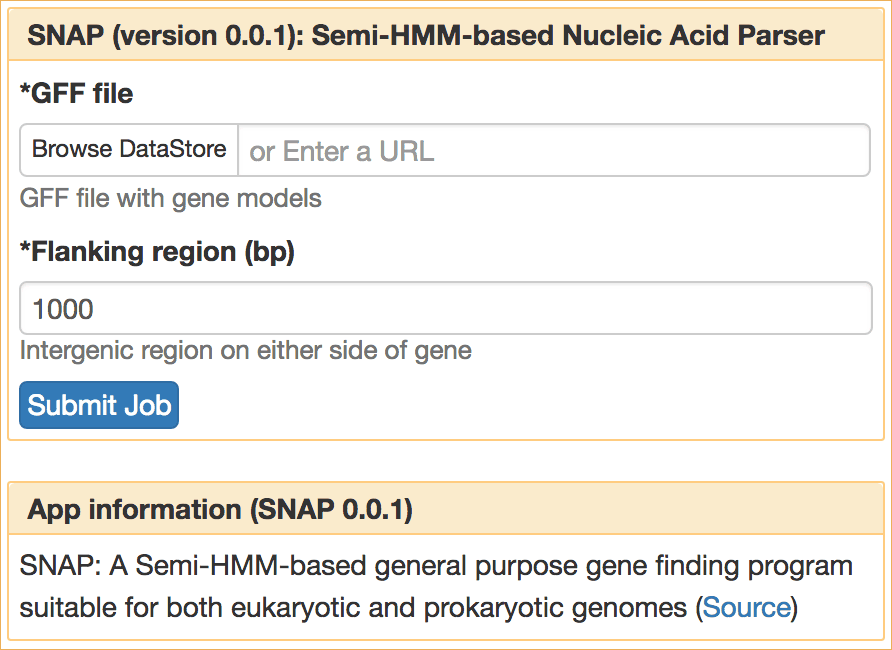
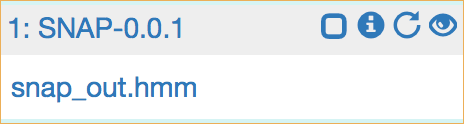

|CyVerse logo|_

|Home_Icon|_
`Learning Center Home <http://learning.cyverse.org/>`_

Launching an SciApps Analysis Job
----------------------------------

For analyzing data, you can select an App from the left panel of SciApps.
In this example, to cover the minimum you need to launch an analysis, we will
use the `SNAP <https://github.com/KorfLab/SNAP>`_ gene finding app to estimate
Hidden Markov Model (HMM) parameters with a GFF file output from MAKER, an
annotation App.

----

.. #### Comment: short description

**Example Data**

.. list-table::
    :header-rows: 1

    * - Input
      - Description
      - Example
    * - Annotated gene models
      - MAKER output in GFF3 format
      - `maker_out.gff <https://data.sciapps.org/example_data/maker/maker_out.gff>`_

**SciApps App(s):**

.. list-table::
    :header-rows: 1

    * - App name
      - Version
      - Description
      - App link
      - Notes/other links
    * - SNAP
      - 0.0.1
      - Semi-HMM-based Nucleic Acid Parser
      - `App link <https://www.sciapps.org/app_id/SNAP-0.0.1>`_
      - `App documentation <http://korflab.ucdavis.edu/software.html>`_

*Example Analysis: HMM parameters estimation with SNAP*
~~~~~~~~~~~~~~~~~~~~~~~~~~~~~~~~~~~~~~~~~~~~~~~~~~~~~~~~~~~~~~~~~

  1. Login to `SciApps <https://www.SciApps.org/>`_

  2. Click this `link to open to SNAP 0.0.1 <https://www.sciapps.org/app_id/SNAP-0.0.1>`_
     or click **Prediciton** category from the left panel; and select SNAP.

  3. Under “GFF file” click **or Browse DataStore**, then navigate the example data
     (*public > maker > maker_out.gff*); select **maker_out.gff** and click
     'Select and Close'. to and select

       |snap_app|

       .. Tip::
         For smaller files (<10 MB), you can click **Choose File** to select from
         your local computer

  4. Leave other parameters as default, and then click **Submit Job**. You will
     be asked to confirm; click "Submit". You will be prompted to check the job
     status in the right panel.

       .. Tip::
         In the right panel, each analysis job is designated with a number and an
         App id (e.g. 1: SNAP-0.0.1). Outputs (e.g. my.all.hmm) are displayed after
         clicking the job name and job status is displayed after clicking the (i)
         icon.

         |status|

         From left to right, there are three icons next to each job name:

         - **Checkbox**: If checked, the analysis will be added to the workflow
           building page
         - **Information**: More information about the status of the analysis
           job and link to the output folder (for an example, check the screenshot below)
         - **Re-submit**: Relaunch the analysis job with same inputs and parameters
           |agave_status|

     .. Note::
       Outputs displayed under job names are defined outputs in Agave app JSON.
       They are the ones that should be used in workflow construction.
       The output folder contains complete outputs from the analysis job and it
       can be accessed through the Information icon

----

**Fix or improve this documentation:**

- On Github: `Repo link <https://github.com/CyVerse-learning-materials/SciApps_guide>`_
- Send feedback: `Tutorials@CyVerse.org <Tutorials@CyVerse.org>`_

----

.. |CyVerse logo| image:: ./img/cyverse_rgb.png
    :width: 500
    :height: 100
.. _CyVerse logo: http://learning.cyverse.org/
.. |Home_Icon| image:: ./img/homeicon.png
    :width: 25
    :height: 25
.. _Home_Icon: http://learning.cyverse.org/

.. |agave_status| image:: ./img/sci_apps/agave_status.gif
    :width: 550
    :height: 322
