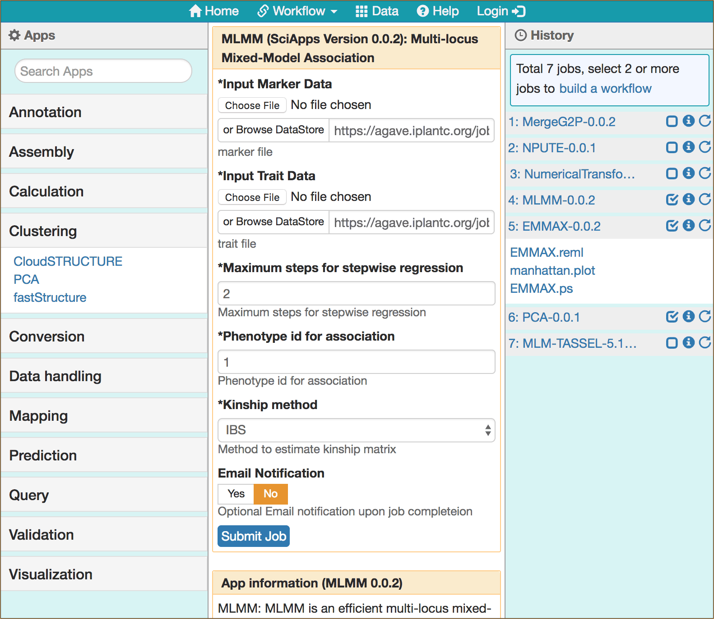

|CyVerse logo|_

|Home_Icon|_
`Learning Center Home <http://learning.cyverse.org/>`_

Building a Workflow
--------------------
A workflow is a series of apps chained together to run in sequence as a batch operation. On SciApps, workflows are generated from the analysis already completed in a history. Workflows can be viewed, shared, imported, and executed. Additionally, SciApps workflows capture inputs, intermediate outputs, and final results along with the analysis history. Importing a workflow will import the analysis history used to build the workflow.

----

*Step 1: Importing a Workflow History*
~~~~~~~~~~~~~~~~~~~~~~~~~~~~~~~~~~~~~~~
This step will show you how to import a history/workflow from a remote source into your own workspace. We will be using this history to build a new workflow. The example used here is the public association workflow.

  1. Login to `SciApps <https://www.SciApps.org/>`_

  2. Click 'Workflow' (from the top navigation bar), then 'Public workflows' to load the public workflow page in the main panel
     
     .. Tip::
       When the right panel (History) is empty, Click the 'public workflow' link (on the top of the History panel) to load the public workflow page
       
  3. Click the 'Association' link to load the Association Workflow. The app forms are loaded in the main panel, and analysis history is loaded in the right panel.
  
     |association_workflow|
      
     .. Tip::
       To view the workflow diagram, scroll down the main panel and click the 'Show Diagram' button

----

*Step 2: Creating a Workflow*
~~~~~~~~~~~~~~~~~~~~~~~~~~~~~~
This step will show you how to build a workflow from the loaded history. Assume we just want to use EMMAX for association analysis.

   1. Check the checkbox for step 1, 2, 3, and 6 in the History panel
   
   2. Click the 'build a workflow' link (on the top of the History panel) to load the Workflow building page
      
      |build_workflow|
      
      .. Note::
        Alternatively, Click 'Workflow' (from the top navigation bar), then 'Build a workflow' to load the workflow building page

   3. Modify **Workflow Name** and **Workflow Description**, then click the 'Build Workflow' button to visualize the workflow
   
   4. On the 'Workflow Diagram', you can choose to download or save the new workflow
   
      .. Tip::
        History panel Checkboxes and the workflow building page are interactive. Use the 'Select All' or 'Reset' button to simplify the selections
	
----

*Step 3: Launching a Workflow*
~~~~~~~~~~~~~~~~~~~~~~~~~~~~~~
This step 

----

**Fix or improve this documentation:**

- On Github: `Repo link <https://github.com/CyVerse-learning-materials/SciApps_guide>`_
- Send feedback: `Tutorials@CyVerse.org <Tutorials@CyVerse.org>`_

----

.. |CyVerse logo| image:: ./img/cyverse_rgb.png
    :width: 500
    :height: 100
.. _CyVerse logo: http://learning.cyverse.org/
.. |Home_Icon| image:: ./img/homeicon.png
    :width: 25
    :height: 25
.. _Home_Icon: http://learning.cyverse.org/

.. |build_workflow| image:: ./img/sci_apps/build_workflow.gif
    :width: 660
    :height: 359
