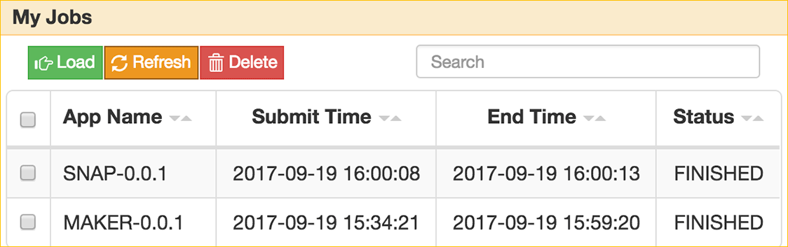
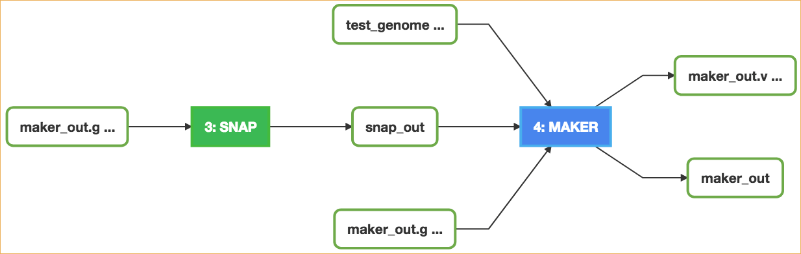

|CyVerse logo|_

|Home_Icon|_
`Learning Center Home <http://learning.cyverse.org/>`_


Building a Workflow
------------------------------
A workflow is a series of Apps chained together to run in sequence as a batch operation. On SciApps, workflows are generated from the completed analyses. Here we will show how to build a two-step workflow with SNAP and MAKER for a second round annotation.  

----


**Example Data**

.. list-table::
    :header-rows: 1

    * - Input
      - Description
      - Example
    * - Assembled genome
      - A scaled-down genome that is comprised of the first 300kb of three chromosomes of rice
      - `test_genome.fasta <https://data.sciapps.org/example_data/maker/test_genome.fasta>`_
    * - Annotated gene models
      - MAKER output in GFF3 format (gzipped)
      - `my.all.gff.gz <https://data.sciapps.org/example_data/maker/my.all.gff.gz>`_
    * - SNAP HMM estimation
      - HMM parameters estimated with SNAP
      - `my.all.hmm <https://data.sciapps.org/results/job-6189497920853643751-242ac113-0001-007-job-for-snap-0-0-1/my.all.hmm>`_

**Apps:**

.. list-table::
    :header-rows: 1

    * - App name
      - Version
      - Description
      - App link
      - Notes/other links
    * - MAKER
      - 0.0.1
      - A portable and easily configurable genome annotation pipeline
      - `MAKER-0.0.1 <https://www.sciapps.org/app_id/MAKER-0.0.1>`_
      - `MAKER documentation <http://www.yandell-lab.org/software/maker.html/>`_
    * - SNAP
      - 0.0.1
      - Semi-HMM-based Nucleic Acid Parser
      - `SNAP-0.0.1 <https://www.sciapps.org/app_id/SNAP-0.0.1>`_
      - `SNAP documentation <http://korflab.ucdavis.edu/software.html>`_

*Step 1: Running MAKER with SNAP output*
~~~~~~~~~~~~~~~~~~~~~~~~~~~~~~~~~~~~~~~~~~~~~~~~
This step will show you how to use SNAP output with MAKER to do a second around annotation.

  1. Login to SciApps at https://www.SciApps.org.

  2. Run SNAP as in the last section if you haven't. 

     .. Tip::
       Jobs disappear from the History panel when the browser gets refreshed. To load completed jobs to the History panel, click 'Workflow' then 'My jobs' to select.

       |myjobs_window|

  3. Click **Annotation** category (left panel) or search for **MAKER**, then click **MAKER** to load **MAKER-0.0.1**.

     |build_workflow2|

  4. Under “Genome sequence file” click **or Browse DataStore**, then navigate the exampleData (*example_data > maker*); select **test_genome.fasta** and click 'Select and Close'.

  5. Click **SNAP-0.0.1** in the History panel to expand its outputs, then
     drag and drop **my.all.hmm** into the **SNAP HMM file** field.

  6. Under “Maker annotations” click **or Browse DataStore**, then navigate the exampleData (*example_data > maker*); select **my.all.gff.gz** and click 'Select and Close'.

  7. Leave others as defaults, then click the "Submit Job" button.

  8. Once COMPLETED, click **MAKER-0.0.1** in the History panel to expand its outputs, then click **maker_output.jbrowse** to visualize annotation results.

     .. Note::
       You will get an email notification if selected 'Yes' before 'Submit Job', or you can click on the 'i' icon to check the analysis status. For manual annotation of the MAKER results with Apollo, go to http://data.maizecode.org/apollo with username: demo@demo.com, and password: demo.         

----

*Step 2: Creating a Workflow*
~~~~~~~~~~~~~~~~~~~~~~~~~~~~~~~~~~~~~~~
This step will show you how to build a two-step workflow with previously completed MAKER and SNAP jobs.

  1. Check the checkboxes for step 1 (SNAP), and step 2 (MAKER) in the History panel, then click the ‘build a workflow’ link to load the Workflow building page.

     |build_workflow3|
    
     .. Tip::
        History panel Checkboxes and the workflow building page are interactive. Use the 'Select All' or 'Reset' button to simplify the selection process.

  2. Modify **Workflow Name** and **Workflow Description**, then click the ‘Build Workflow’ button to visualize the workflow.

     |annotation_workflow2|

     .. Note::
       The connection between **SNAP-0.0.1** and **MAKER-0.0.1**  (via **my.all.hmm**) is recorded through **dragging and dropping**.

  3. On the 'Workflow Diagram', you can save the workflow. Your saved workflows will appear in 'My Workflows' (under the 'Workflow' menu from top navigation panel).

     .. Tip::
       You can download the workflow from 'My workflows' as a JSON file, which can be passed to others for **sharing** the entire analysis.

----

*Step 3: Running a Workflow*
~~~~~~~~~~~~~~~~~~~~~~~~~~~~~~~~~~~~~~~
This step will show you how to run a workflow you created or someone shared with you.

  1. Navigate to ‘Workflow’, then ‘My workflows’, to load the workflow you created and saved (in **Step 2**).

     |myworkflows_window|

  2. Alternatively, you can load the workflow by navigating to 'Workflow', 'Load a workflow', then paste this URL: https://data.sciapps.org/misc/my_workflow.json or load a workflow JSON file from your PC.

     |load_workflow|
 
     .. Tip::
       Double click on workflow name or description to make modifications.

  3. Scroll down the main panel, then click **Submit Workflow**. You will be asked to confirm and prompted to check the job status in the right panel. Then a live workflow diagram will be displayed with real-time analysis status updates.

     .. Note::

       |running_workflow|

       The colour of the app node will change when the status of the analysis changes:

       - 'Yellow': Pending
       - 'Blue': Running
       - 'Green': Completed
       - 'Red': Failed

----

*Summary*
~~~~~~~~~

Using the apps SNAP and MAKER as examples, you have gotten an overview of how to use SciApps - from accessing data in CyVerse Data Store to launching jobs, building workflows, importing workflows, running workflows, and visualizing results.


More help and additional information
`````````````````````````````````````

..
    Short description and links to any reading materials

Search for an answer:
    `CyVerse Learning Center <http://learning.cyverse.org>`_ or
    `CyVerse Wiki <https://wiki.cyverse.org>`_

Post your question to the user forum:
    `Ask CyVerse <http://ask.iplantcollaborative.org/questions>`_

----

**Fix or improve this documentation:**

- On Github: `Repo link <https://github.com/CyVerse-learning-materials/SciApps_guide/blob/master/step4.rst>`_
- Send feedback: `Tutorials@CyVerse.org <Tutorials@CyVerse.org>`_

----

  |Home_Icon|_
  `Learning Center Home <http://learning.cyverse.org/>`_

.. |CyVerse logo| image:: ./img/cyverse_rgb.png
    :width: 500
    :height: 100
.. _CyVerse logo: http://learning.cyverse.org/
.. |Home_Icon| image:: ./img/homeicon.png
    :width: 25
    :height: 25
.. _Home_Icon: http://learning.cyverse.org/

.. |build_workflow2| image:: ./img/sci_apps/build_workflow2.gif
    :width: 660
    :height: 246
.. |build_workflow3| image:: ./img/sci_apps/build_workflow3.gif
    :width: 660
    :height: 294
.. |annotation_workflow2| image:: ./img/sci_apps/annotation_workflow2.gif
    :width: 660
    :height: 320
.. |myworkflows_window| image:: ./img/sci_apps/my_workflow.gif
    :width: 660
    :height: 240
.. |load_workflow| image:: ./img/sci_apps/load_workflow.gif
    :width: 600
    :height: 135

