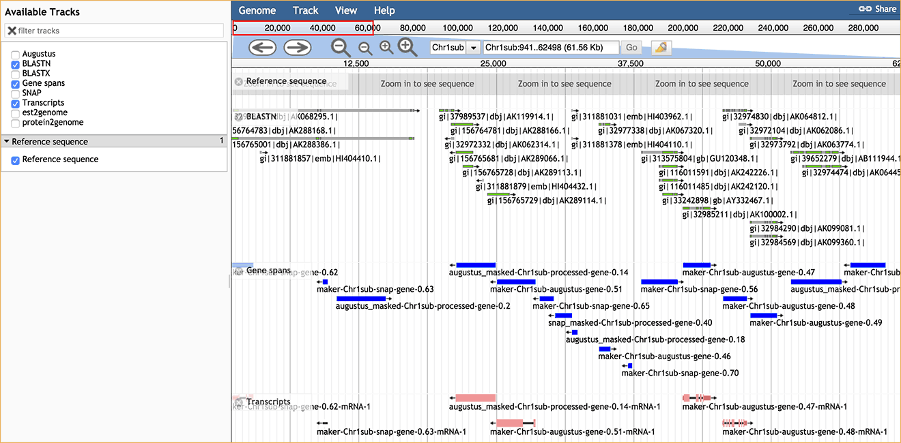

|CyVerse logo|_

|Home_Icon|_
`Learning Center Home <http://learning.cyverse.org/>`_


Building a Workflow
------------------------------
A workflow is a series of Apps chained together to run in sequence as a batch operation. On SciApps, workflows are generated from the completed analyses. Here we will show how to build a two-step workflow with SNAP and MAKER for a second round annotation.  

----


**Example Data**

.. list-table::
    :header-rows: 1

    * - Input
      - Description
      - Example
    * - Assembled genome
      - A scaled-down genome that is comprised of the first 300kb of three chromosomes of rice
      - `test_genome.fasta <http://datacommons.cyverse.org/browse/iplant/home/sciapps/example/maker/test_genome.fasta>`_
    * - Annotated gene models
      - MAKER output in GFF3 format (gzipped)
      - `maker_out.gff.gz <http://datacommons.cyverse.org/browse/iplant/home/sciapps/example/maker/maker_out.gff.gz>`_
    * - SNAP HMM estimation
      - HMM parameters estimated with SNAP
      - `snap_out.hmm <http://datacommons.cyverse.org/browse/iplant/home/lwang/sci_data/results/SNAP-0.0.1_d603d196-8999-4866-8c49-000b1f226454/snap_out.hmm>`_

**Apps:**

.. list-table::
    :header-rows: 1

    * - App name
      - Version
      - Description
      - App link
      - Notes/other links
    * - MAKER
      - 0.0.1
      - A portable and easily configurable genome annotation pipeline
      - `MAKER-0.0.1 <https://www.sciapps.org/app_id/MAKER-0.0.1>`_
      - `MAKER documentation <http://www.yandell-lab.org/software/maker.html/>`_
    * - SNAP
      - 0.0.1
      - Semi-HMM-based Nucleic Acid Parser
      - `SNAP-0.0.1 <https://www.sciapps.org/app_id/SNAP-0.0.1>`_
      - `SNAP documentation <http://korflab.ucdavis.edu/software.html>`_

*Step 1: Running MAKER with SNAP output*
~~~~~~~~~~~~~~~~~~~~~~~~~~~~~~~~~~~~~~~~~~~~~~~~
This step will show you how to use SNAP output with MAKER to do a second around annotation.

  1. Login to SciApps at https://www.SciApps.org.

  2. Run SNAP as in the last section if you haven't. 

     .. Tip::
       Jobs will disappear from the History panel when the browser gets refreshed. To load jobs back to the History panel, click 'Workflow' then 'My jobs' to select them.

       |myjobs_window|

  3. Click **Annotation** category (left panel) or search for **MAKER**, then click **MAKER-2.32** to load the app form.

  4. Click **SNAP-0.0.1** in the History panel to expand its outputs, then drag and drop **snap_out.hmm** into the **SNAP HMM file** field.

     |build_workflow2|

  5. Under “Genome sequence file” click **Browse DataStore**, then navigate the example (*sciapps > example > maker*); select **test_genome.fasta** and click 'Select and Close'.

  6. Under “Maker annotations” click **Browse DataStore**, then navigate the example data (*sciapps > example > maker*); select **maker_out.gff.gz** and click 'Select and Close'.

  7. Leave others as defaults, then click the "Submit Job" button.

  8. Once COMPLETED, click the 'Visualization' icon (next to the **MAKER-2.32** job in the History panel), select **jbrowse_out.view.tgz** and then click 'Visualize' to visualize the annotation results in a genome browser.

     |jbrowse_out|

     .. Note::
       Select the tracks in the left panel to visualize. For new analysis, it may take a while for visualization to be ready since the results need to be copied from CyVerse Data Store to the SciApps visualization server.         

----

*Step 2: Creating a Workflow*
~~~~~~~~~~~~~~~~~~~~~~~~~~~~~~~~~~~~~~~
This step describes how to build a two-step workflow with previously completed MAKER and SNAP jobs.

  1. Check the checkboxes for step 1 (SNAP), and step 2 (MAKER) in the History panel, then click the ‘build a workflow’ link to load the Workflow building page.

     |build_workflow3|
    
     .. Tip::
        History panel Checkboxes and the workflow building page are interactive. Use the 'Select All' or 'Reset' button to simplify the selection process.

  2. Click the ‘Build Workflow’ button to build a workflow with selected jobs. Once built, a workflow diagram will be open for visual inspection.

     |annotation_workflow2|

     .. Tip::
       Click the 'Top Down' button to draw the workflow diagram vertically.

  3. On the 'Workflow Diagram', you can save the workflow. Your saved workflows will appear in 'My workflows' (under the 'Workflow' menu from top navigation panel).

     .. Tip::
       While saving a workflow, you can rename it and/or add a short description.

----

*Step 3: Running a Workflow*
~~~~~~~~~~~~~~~~~~~~~~~~~~~~~~~~~~~~~~~
This step will show you how to run a workflow.

  1. Navigate to ‘Workflow’, then ‘My workflows’, to load the workflow you created and saved (in **Step 2**).

     |myworkflows_window|

     .. Note::

       Five operations are supported for a selected workflow:
   
       - 'Load': Display app forms (main panel) and load job histories (right panel)
       - 'Visualize': Display workflow diagram and load job histories
       - 'Share': Get a direct link to the workflow for sharing
	 |workflow_URL|
       - 'Download': Download the workflow JSON file 
       - 'Delete': Delete the workflow

     .. Tip::
       Double click on workflow name or description to make modifications.

  2. Alternatively, you can load the app forms and job histories directly if you have the direct link for a workflow. Scroll down the app forms in the main panel to either submit a new run or view the workflow diagram.

  3. Scroll down the main panel, then click **Submit Workflow**. You will be asked to confirm and prompted to check the job status in the right panel. Then a live workflow diagram will be displayed with real-time analysis status updates.

     .. Note::

       |running_workflow|

       The colour of the app node will change when the status of the analysis changes:

       - 'Yellow': Pending
       - 'Blue': Running
       - 'Green': Completed
       - 'Red': Failed

     .. Tip::
        A running workflow can also be saved then selected (in 'My workflows') to visualize its running status later on.

----

*Summary*
~~~~~~~~~

Using the apps SNAP and MAKER as examples, you have gotten an overview of how to use SciApps - from accessing data in CyVerse Data Store to launching jobs, building workflows, importing workflows, running workflows, and visualizing results.


More help and additional information
`````````````````````````````````````

..
    Short description and links to any reading materials

Search for an answer:
    `CyVerse Learning Center <http://learning.cyverse.org>`_ or
    `CyVerse Wiki <https://wiki.cyverse.org>`_

Post your question to the user forum:
    `Ask CyVerse <http://ask.iplantcollaborative.org/questions>`_

----

**Fix or improve this documentation:**

- On Github: `Repo link <https://github.com/CyVerse-learning-materials/SciApps_guide/blob/master/step4.rst>`_
- Send feedback: `Tutorials@CyVerse.org <Tutorials@CyVerse.org>`_

----

  |Home_Icon|_
  `Learning Center Home <http://learning.cyverse.org/>`_

.. |CyVerse logo| image:: ./img/cyverse_rgb.png
    :width: 500
    :height: 100
.. _CyVerse logo: http://learning.cyverse.org/
.. |Home_Icon| image:: ./img/homeicon.png
    :width: 25
    :height: 25
.. _Home_Icon: http://learning.cyverse.org/
.. |myjobs_window| image:: ./img/sci_apps/myjobs_window.gif
    :width: 627
    :height: 245
.. |build_workflow2| image:: ./img/sci_apps/build_workflow2.gif
    :width: 661
    :height: 311
.. |build_workflow3| image:: ./img/sci_apps/build_workflow3.gif
    :width: 660
    :height: 198
.. |annotation_workflow2| image:: ./img/sci_apps/annotation_workflow2.gif
    :width: 656
    :height: 208
.. |myworkflows_window| image:: ./img/sci_apps/my_workflow.gif
    :width: 656
    :height: 170
.. |workflow_URL| image:: ./img/sci_apps/workflow_URL.gif
    :width: 582
    :height: 182
.. |running_workflow| image:: ./img/sci_apps/running_workflow2.gif
    :width: 617
    :height: 196

