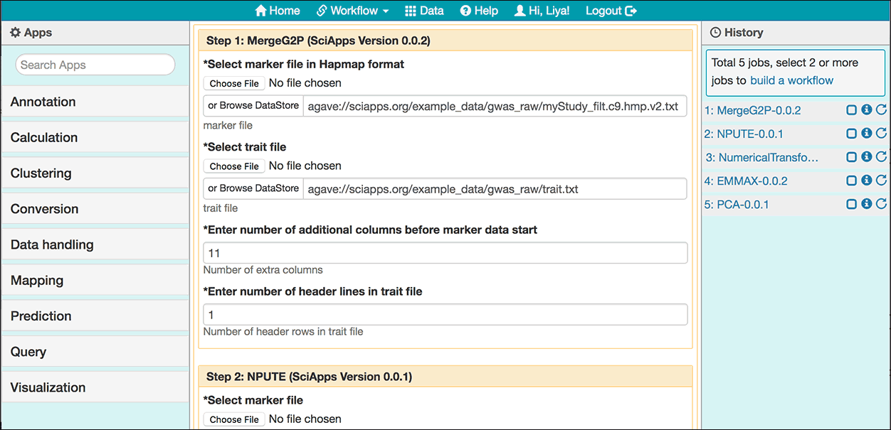

|CyVerse logo|_

|Home_Icon|_
`Learning Center Home <http://learning.cyverse.org/>`_


Running a Workflow
-------------------
Here we will run the workflow created in the 'Building a Workflow' section. As a generic use case, we will replace the marker file in the first step. The only difference is that the new marker file has the version 2 Sorghum bicolor genome coordinates (old marker file has version 1), which is the Genome version hosted on the `Gramene <http://gramene.org/>`_ website. Since we are going to visualize the results along with the Annotation data from Gramene.

----

*Running the example Association Workflow*
~~~~~~~~~~~~~~~~~~~~~~~~~~~~~~~~~~~~~~~~~~~

  1. Login to `SciApps <https://www.SciApps.org/>`_
  
  2. Load the workflow you created in the last section or use `this file <https://data.sciapps.org/misc/my_pca_workflow.json>`_

     .. Tip::
       Before loading a workflow, refresh the Browser tab to clear the History panel 
       
  3. For **Step 1: MergeG2P**, under **Select marker file in Hapmap format** click the **or Browse DataStore** button, then navigate to and select `myStudy_filt.c9.hmp.v2.txt <https://data.sciapps.org/example_data/gwas_raw/myStudy_filt.c9.hmp.v2.txt>`_; then click ‘Select and Close’. (Location: *public > gwas_raw > myStudy_filt.c9.hmp.v2.txt*) 

     |run_workflow|
     
     .. Note::
       When browsing DataStore, default is always the location you recently visited, unless you cleared your browser cache 
   
  4. Leave others as defaults, scroll down the main panel, and then click **Submit Workflow**. You will be asked to confirm and prompted to check the job status in the right panel. Then a live workflow diagram will be displayed with real time analysis status updates.
     
     .. Note::
     
       |running_workflow|
       
       The color of the app node will change when the status of the analysis changes:
       
       - 'Yellow': Pending
       - 'Blue': Running
       - 'Green': Completed
       - 'Red': Failed
    
----

*Visualizing Result*
~~~~~~~~~~~~~~~~~~~~~~~~~~~

   1. Once the entire workflow is completed, click **4: EMMAX-0.0.2** in the History panel to expand its outputs. 
   
      |workflow_results|
      
   2. Click **manhattan.plot** from the list of outputs, you will be directed to the Manhattan plot of the results. Check Q-Q plot and click the Manhattan plot to check nearby genes around the clicked position.
   
      |manhattan_plot|
  
      .. Note::
        The example here is using Chromosome 9 only. And the Manhattan plot is pre-configured to display the same Chromosome. For your own data, use the options on the left side to check a specific Chromosome, or all Chromosomes of your specific genome.

   3. Use the options on the left side for P-values adjustments, specifying species, chromosome, neighbouring window size, and display Q-Q plot.
   
      .. Tip::
        Both Manhattan plot and Q-Q plot are interactive with all of the options.
     
   4. For visualizing **PCA** outputs, click the **(i)** icon for **5: PCA-0.0.1**, then click the output folder link, you will be directed to the data page of PCA outputs. There are two image outputs:  `pcplot <https://cran.r-project.org/web/packages/ggfortify/vignettes/plot_pca.html>`_ and `scree plot <http://support.minitab.com/en-us/minitab/17/topic-library/modeling-statistics/multivariate/principal-components-and-factor-analysis/what-is-a-scree-plot/>`_
   
      |pca_output1| |pca_output2|
      
----

*Summary*
~~~~~~~~~

Using the app SNAP and the Association workflow as examples, you have gotten an overview of how SciApps workflows work - from accessing data in CyVerse Data Store, to launching jobs, building workflows, running workflows, and visualizing results.

..
    Summary

**Next Steps:**

- Try a tutorial using the SciApps in the `Learning Center <http://learning.cyverse.org>`_

More help and additional information
`````````````````````````````````````

..
    Short description and links to any reading materials

Search for an answer:
    `CyVerse Learning Center <http://learning.cyverse.org>`_ or
    `CyVerse Wiki <https://wiki.cyverse.org>`_

Post your question to the user forum:
    `Ask CyVerse <http://ask.iplantcollaborative.org/questions>`_

----

**Fix or improve this documentation:**

- On Github: `Repo link <https://github.com/CyVerse-learning-materials/SciApps_guide>`_
- Send feedback: `Tutorials@CyVerse.org <Tutorials@CyVerse.org>`_

----

.. |CyVerse logo| image:: ./img/cyverse_rgb.png
    :width: 500
    :height: 100
.. _CyVerse logo: http://learning.cyverse.org/
.. |Home_Icon| image:: ./img/homeicon.png
    :width: 25
    :height: 25
.. _Home_Icon: http://learning.cyverse.org/

.. |running_workflow| image:: ./img/sci_apps/running_workflow.gif
    :width: 660
    :height: 299
.. |workflow_results| image:: ./img/sci_apps/workflow_results.gif
    :width: 660
    :height: 300
.. |manhattan_plot| image:: ./img/sci_apps/manhattan_plot.gif
    :width: 660
    :height: 355
.. |pca_output1| image:: ./img/sci_apps/pca_output1.gif
    :width: 300
    :height: 297
.. |pca_output2| image:: ./img/sci_apps/pca_output2.gif
    :width: 300
    :height: 284
